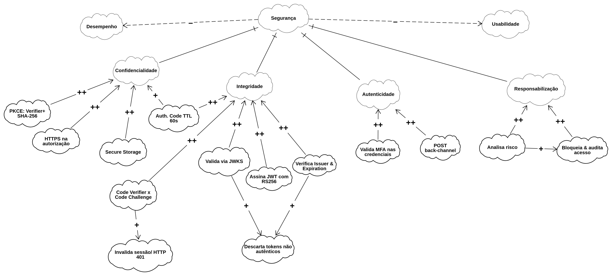

# SIG | NFR Framework 

---

## Participantes 
| Nome do Membro | 
| :--- |
| [Artur Galdino](https://github.com/ArturFGaldino) |
| [Giovani Coelho](https://github.com/Gotc2607) |
| [João Leles](https://github.com/joaoleless) |
| [Nicole Jovita](https://github.com/nicolejovita) |

---

## Fundamentação 
### O que é um NFR (Requisito Não Funcional)

NFR (Non-Functional Requirement, ou Requisito Não Funcional) é um requisito que não descreve uma função específica que o sistema deve executar, mas sim uma qualidade ou restrição sobre _como_ essas funções devem ser realizadas — por exemplo, usabilidade, segurança, desempenho, privacidade ou acessibilidade. Enquanto um requisito funcional responde "o que o sistema faz" (ex.: "o usuário deve conseguir buscar uma unidade de saúde"), um NFR responde "com que qualidade" isso deve acontecer (ex.: "a busca deve ser acessível a usuários com baixo letramento digital").

Chung et al. (2000) argumentam que NFRs raramente podem ser completamente satisfeitos de forma binária (sim/não): eles são, na prática, _softgoals_, sem um critério de satisfação claro e objetivo, cujo cumprimento é sempre uma questão de grau e de compromisso com outros objetivos do sistema. É justamente por isso que o NFR Framework trata a Usabilidade do Meu SUS Digital não como uma caixa a ser marcada, mas como um softgoal a ser refinado, discutido e avaliado ao longo do processo de design, o que motiva o uso do SIG descrito a seguir.

Para mais informações sobre: [Guia NFR Framework](../../../Projeto/GuiaNFR.md)

### O que é um SIG (Softgoal Interdependency Graph)

O SIG (Softgoal Interdependency Graph, ou Grafo de Interdependência de Softgoals) é a notação gráfica proposta pelo NFR Framework (CHUNG et al., 2000) para representar como um softgoal de alto nível se decompõe em softgoals mais específicos, e como decisões de design concretas impactam essa rede de objetivos. Um SIG é composto principalmente por três tipos de elementos:

- **Softgoals**: os próprios requisitos não funcionais, em diferentes níveis de abstração (ex.: Usabilidade → Acessibilidade → Percepção). Representados como nuvens de borda fina.
- **Métodos de Operacionalização**: decisões concretas de design ou implementação que contribuem — positiva ou negativamente — para um ou mais softgoals (ex.: "Autenticação via CPF e senha"). Representados como nuvens de borda grossa.
- **Claims**: argumentos ou justificativas usados para embasar por que determinada contribuição foi avaliada de certa forma, geralmente quando o contexto importa para a interpretação do link. Representados como nuvens de borda tracejada.

Esses elementos são conectados por **links de contribuição** (rotulados com `++`, `+`, `-` ou `--`), que indicam o quanto um nó filho satisfaz ou prejudica o nó pai, e podem opcionalmente receber avaliações finais (`!` crítico, `✓` aceito, `X` rejeitado) que sintetizam o resultado da análise para cada softgoal.

O valor do SIG está em tornar **explícitas e rastreáveis** as decisões de design e seus trade-offs: como o mesmo método pode satisfazer um softgoal enquanto prejudica outro, e como esse raciocínio pode ser revisitado posteriormente — funcionando como um registro do processo de design, e não apenas do seu resultado final.

---

## Organização 
A equipe organizou-se por meio de uma reunião inicial, na qual definiu-se a divisão estratégica das tarefas para garantir a colaboração contínua de todos os integrantes. Ficou alinhado que João Leles seria o responsável por elaborar a estrutura base do SIG (NFR Framework). Sequencialmente, Artur Galdino, Giovani Coelho e Nicole Jovita atuaram no refinamento do modelo, efetuando revisões e propondo melhorias para consolidar a entrega final. 

Utilizamos como principal ferramenta o [DSM3](https://www.cin.ufpe.br/~jhcp/dsm3goals/nfr.html#) para criar e aprimorar as versões do modelo. As deliberações e os alinhamentos dessa etapa podem ser consultados na [Ata da Reunião - 25/08](/Projeto/Atas/AtasSub1/Ata-25-08.md).

---

## Embasamento Metodológico 
1. CHUNG, Lawrence; NIXON, Brian A.; YU, Eric; MYLOPOULOS, John. [Non-Functional Requirements in Software Engineering](https://drive.google.com/file/d/1afNs6Z9qrAW-tBG53TgI16kxiioFUIb8/view). Boston: Kluwer Academic Publishers, 2000. DOI: 10.1007/978-1-4615-5269-7.
2. SERRANO, Maurício; LEITE, Julio Cesar Sampaio do Prado. [A social interaction based pre-traceability for i* models](http://ftp.informatik.rwth-aachen.de/Publications/CEUR-WS/Vol-766/paper23.pdf). In: INTERNATIONAL I* WORKSHOP, 5., 2011. CEUR Proceedings of the 5th International i* Workshop (iStar 2011). [S. l.]: CEUR-WS, 2011. p. 132-137. (Base teórica para a seção "Rastreabilidade com o Artefato Generalista".)
3. SERRANO, Milene; SERRANO, Maurício. [Requisitos – Aula 17: NFR Framework](https://drive.google.com/file/d/1barJrSu7LXNuprttazBs7J7nVgCTgul8/view). Material de aula. Universidade de Brasília (UnB) - Faculdade do Gama (FGA).  

---
## Evolução do SIG

### Versão 1.0

<b>Clique aqui para abrir e copiar o arquivo goalModel.txt (Versão 1.0)</b>

[goalModel.txt](../assets/subequipe01-fluxos/NFR/nfr-goalModel-versao1.0.txt ':include :type=code json')

#### Integrante Responsável
- [João Leles](https://github.com/joaoleless)

---

### Versão 1.1

<b>Clique aqui para abrir e copiar o arquivo goalModel.txt (Versão 1.1)</b>

[goalModel.txt](../assets/subequipe01-fluxos/NFR/nfr-goalModel-versao1.1.txt ':include :type=code json')

#### Integrante Responsável
- [Giovani Coelho](https://github.com/Gotc2607)

#### O que mudou em relação à versão anterior
- Adição do nó principal de Privacidade
- Adição de dois nós de especialização para o nó de Privacidade

---

### Versão 1.2

<b>Clique aqui para abrir e copiar o arquivo goalModel.txt (Versão 1.1)</b>

[goalModel.txt](../assets/subequipe01-fluxos/NFR/nfr-goalModel-versao1.2.txt ':include :type=code json')

#### Integrante Responsável
- [Artur Galdino](https://github.com/ArturFGaldino)
- [Nicole Jovita](https://github.com/nicolejovita)

#### O que mudou em relação à versão anterior
- Mapeamento de Conflitos (Trade-offs): Adicionados impactos diretos em Desempenho e em Usabilidade
- Confidencialidade: Adição de mTLS e Criptografia em Repouso (AES-256); atualização para TLS 1.3; remoção de nós redundantes de validação de sessão.
- Integridade: Adição de Padronização HL7 FHIR e Log Imutável via SHA-256; remoção de nós duplicados.
- Autenticidade: Troca de Valida MFA por Validação de assinatura do ID Token RS256.
- Privacidade & Responsabilização: Unificação dos termos/consentimentos em Gestão de Consentimento Explícito e Log Auditável; substituição de Analisa risco por Registro de Logs de sessão e consentimento.

---
## Histórico de Versionamento

| Nome do Membro | Contribuição | Data |
| :--- | :--- | :--- |
| [Artur Galdino](https://github.com/ArturFGaldino) | Criar o template | 27/08/2026 |
| [João Leles](https://github.com/joaoleless) | Inserção da versão 1.0 com diagrama inicial | 27/08/2026 |
| [Giovani Coelho](https://github.com/Gotc2607) | Inserção da versão 1.1 - Adição do nó de privacidade e seus dois nós de especialização | 27/08/2026 |
| [Nicole Jovita](https://github.com/nicolejovita) | Estruturação: fundamentação NFR & SIG, organização da equipe e embasamento metodológico | 28/08/2026 |
| [Artur Galdino](https://github.com/ArturFGaldino) e [Nicole Jovita](https://github.com/nicolejovita) | Inserção da versão 1.2 (final) | 28/08/2026 |
