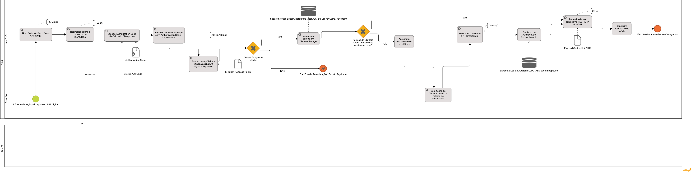
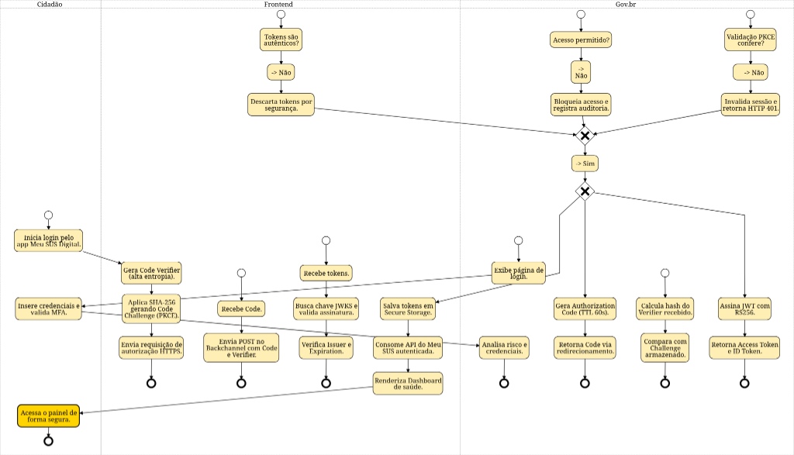

# BPMN Finalizado

---

## Engenharia Reversa & Modelagem BPMN

### Participantes
| Nome do Membro | 
| :--- |
| [Artur Galdino](https://github.com/ArturFGaldino) |
| [Giovani Coelho](https://github.com/Gotc2607) |
| [João Leles](https://github.com/joaoleless) |
| [Nicole Jovita](https://github.com/nicolejovita) |

### Metodologia 
A equipe organizou-se por meio de uma reunião inicial, na qual definiu-se a divisão estratégica das tarefas para garantir a colaboração contínua de todos os integrantes. Ficou alinhado que Giovani Coelho seria o responsável por elaborar a estrutura base do Fluxo BPMN. Sequencialmente, Artur Galdino, João Leles e Nicole Jovita atuaram no refinamento do fluxo, adicionando notas técnicas, efetuando revisões do modelo e propondo melhorias para consolidar a entrega final. 

O trabalho foi realizado com foco no fluxo de autenticação via Gov.br, analisando-o sob uma perspectiva de cibersegurança. Para isso, foi conduzida uma experimentação prática no aplicativo Meu SUS Digital e as análises foram baseadas na **documentação de integração do login único do Gov.br**, bem como no padrão **OAuth 2.0 com PKCE especificado na RFC 7636** e nas diretrizes de segurança mobile da **OWASP**. 

Utilizamos as ferramentas [BPMN Sketch Miner](https://www.bpmn-sketch-miner.ai/) e [HEFLO App](https://app.heflo.com/) para criar os modelos.

As deliberações e os alinhamentos dessa etapa podem ser consultados na [Ata da Reunião - 25/08](/Projeto/Atas/AtasSub1/Ata-25-08.md).

### Processo de Engenharia Reversa Aplicado
A Engenharia Reversa foi conduzida sob uma abordagem comportamental (black-box). O processo consistiu na simulação de um fluxo real de autenticação no aplicativo Meu SUS Digital via conta Gov.br, mapeando visualmente os redirecionamentos de navegador e analisando a arquitetura esperada para esse modelo de integração, baseada no protocolo OAuth 2.0 com extensão PKCE (Proof Key for Code Exchange).

Os resultados indicaram que o frontend do aplicativo interage com o Gov.br por meio da geração de pares de verificação (Code Verifier e Challenge), trafegados via backchannel. Após a recepção dos tokens, o sistema realiza a validação das assinaturas via JWKS (JSON Web Key Sets) antes de conceder o acesso ao painel do cidadão.

### Modelagem BPMN
O modelo gerado detalha o fluxo de Autenticação entre o Cidadão, o Meu SUS Digital e o provedor Gov.br.

### Detalhamento do Fluxo 

A tabela abaixo detalha as responsabilidades de cada componente e as justificativas arquiteturais e de cibersegurança para cada etapa, artefato e decisão (*gateways*) modeladas no BPMN, incorporando as validações criptográficas, auditoria de consentimento (LGPD) e o consumo de dados em saúde.

| Ator / Raia | Elemento BPMN (Ação / Decisão / Artefato) | Justificativa de Engenharia e Cibersegurança |
| :--- | :--- | :--- |
| **Cidadão** | **Início:** Inicia login pelo app Meu SUS Digital | Ponto de partida e gatilho do caso de uso de autenticação do usuário. |
| **Meu SUS** | Gera Code Verifier e Code Challenge | Criação de um segredo criptográfico temporário de alta entropia no cliente. Sendo um aplicativo móvel (cliente público), o app não pode armazenar um *Client Secret* fixo com segurança ([RFC 8252](https://datatracker.ietf.org/doc/html/rfc8252)). O cálculo unidirecional com Hash **SHA-256** prepara a mitigação contra interceptação do código de autorização ([RFC 7636 - PKCE](https://datatracker.ietf.org/doc/html/rfc7636)). |
| **Meu SUS** | Redireciona para Provedor de Identidade | Envio da requisição de autorização via canal seguro criptografado em trânsito (**TLS 1.3 / HTTPS**), delegando a autenticação ao Gov.br (*OpenID Connect / OAuth 2.0*). |
| **Gov.br (Caixa-Preta)** | *Message Flow:* Autenticação do Cidadão | Processamento externo das credenciais, fatores biométricos e níveis de conta (Prata/Ouro) fora do escopo interno do app. |
| **Meu SUS** | Recebe Authorization Code via Callback / Deep Link | Recepção do `Authorization Code (Data Object - TTL 60s)` de curtíssimo tempo de vida, minimizando a janela de exposição e riscos de vazamento em logs locais. |
| **Meu SUS** | Envia POST (Backchannel) com Code + Code Verifier | A troca do código pelos tokens ocorre nos bastidores via chamada direta e segura. O envio do *Code Verifier* original prova ao Gov.br que a aplicação que requisita o token é a mesma que iniciou a sessão. |
| **Meu SUS** | Recebe Tokens e valida assinatura digital e expiração | Recepção do `ID Token + Access Token (Data Object)`. O sistema consulta a chave pública (JWKS) oficial do Gov.br para validar a integridade, a assinatura assimétrica (**RSA-256**) e a validade temporal da sessão sem trafegar ou armazenar senhas (Requisito do [Manual de Integração do Gov](https://manual-roteiro-integracao-login-unico.servicos.gov.br/)). |
| **Meu SUS** | **Gateway:** Tokens íntegros e válidos? (Não) | **Proteção contra Man-in-the-Middle (MitM) e forjamento:** Qualquer token com assinatura inválida, expirado ou corrompido é imediatamente descartado, finalizando o fluxo em **Fim de Erro (Tokens Descartados)**. |
| **Meu SUS** | Armazena Tokens em Secure Storage | Persistência segura em cofre criptografado local (*KeyStore/Keychain - Data Store*), prevenindo extração indevida de sessão por malwares ou outros apps ([OWASP Mobile Top 10](https://owasp.org/www-project-mobile-top-10/)). |
| **Meu SUS** | **Gateway:** Termos LGPD já aceitos na base? | Decisão de negócio/conformidade: verifica se o cidadão já possui registro de consentimento prévio válido na versão vigente do documento. |
| **Meu SUS** | Apresenta tela de Termos e Políticas | Se **Não**, exibe a minuta contratual e a política de privacidade para cumprimento do dever de transparência da LGPD. |
| **Cidadão** | Lê e aceita os Termos de Privacidade e Uso | **User Task:** Ação explícita e inequívoca do cidadão concedendo o consentimento para tratamento dos dados de saúde. |
| **Meu SUS** | Gera Log de Consentimento com Hash SHA-256 | Aplicação da função matemática **SHA-256** sobre o registro (IP + Timestamp + Versão dos Termos + ID do Usuário) e persistência no banco de dados de auditoria (*Data Store*), garantindo a imutabilidade e auditabilidade do aceite perante a LGPD. |
| **Meu SUS** | Requisita dados clínicos via REST API / HL7 FHIR | Chamada de serviços protegida por autenticação mútua entre servidores (**mTLS**) utilizando o padrão internacional de interoperabilidade em saúde (**HL7 FHIR**) e consumindo a RNDS (onde os dados em repouso são protegidos por **AES-256**). |
| **Meu SUS** | Renderiza Dashboard de Saúde | Apresentação dos prontuários, exames e registros clínicos validados ao usuário final. |
| **Meu SUS** | **Fim:** Sessão Ativa / Acesso Concedido | Conclusão bem-sucedida do processo com trânsito seguro e conformidade regulatória. |

### Referências 
* [RFC 7636 - Proof Key for Code Exchange by OAuth Public Clients](https://datatracker.ietf.org/doc/html/rfc7636)
* [RFC 8252 - OAuth 2.0 for Native Apps](https://datatracker.ietf.org/doc/html/rfc8252)
* [Manual de Integração Login Único Gov.br](https://manual-roteiro-integracao-login-unico.servicos.gov.br/)
* [OWASP Mobile Security Project](https://owasp.org/www-project-mobile-top-10/)
* [HL7 FHIR](https://hl7.org/fhir/R4/)
* [RFC 8446 - The Transport Layer Security (TLS) Protocol Version 1.3](https://datatracker.ietf.org/doc/html/rfc8446)
* [AES-256](https://doi.org/10.6028/NIST.FIPS.197)

---

## Histórico de Versionamento

### Versão 1.0 

[Acessar diagrama no BPMN Sketch Miner](https://www.bpmn-sketch-miner.ai/index.html#EYBwNgdgXAbgjAKALRIQYQJYBMCGWDHA9lAAQCSEGAxhjiWIQOYYQkgCmDJOIIJAsuwCuJAMoBVUSQAiGZgBccYAHQIAYgCdCEeewhZSAcXYa6aQlnYkAaiYwAzDCZIAKJYpJ75WkLQCUqprauvqkAILg1HSiABJhSABMAKwAbCSMJjj6hCTmlrkAFkpgehmuAAoA0mgAogHqWjp6BiQ1EDC0JBrsAI5CGADOGADnRCT5OELyhBoYAF44ozkxACor5aKqCIaEMMrAGqQ1AB4YwFYgAIfMEHT5DDeqmLgExOQQAyZWVN2WEDQ4QaeEgwJTYOj8NRhVQ7PYHcK3MCDOizAZUHLfX56AGDLZhKjsAYDHIcDQAWww8mwhAA-MgAHwkAByRAQJHZJFh+0OJAAQgw+uxOjgCUSMV12MwBt46JMsJSZrRVEhGaIMGS2RyufDOZkSGEpgVFQsqdpchYrC41gAZEgpAAMA3qHM5u25pAASuxphpbub8h0Uex5d0aNocGSvIQti6gk1QiQvQTzv72KpY40Qi02oGSOUAPKiFYkCA5XkigDWVCKEAgnBI6LJqeBtlmjhMMa1bp1aCUVCEYDoRQGBXGOVbDicGglyep6a7cJ55jJIBwpgbhCbaCKYBKEDKa7JODmejw0YQmvZ1jBuCWeeqNQ3EHsXzpLpVzNZLpd2p5FFBSK4CQnxEmMVjdD6fqrOsJAACz2nA87sh+aoat+C7uvqRIsHQABSADqxaNomojJCkSHfr+nrejMfr4qKAwkCshAVnowJkNITEsXonboXGWbUcmVjTKxHwURmwTNKQvJCGidDVjgMBWARlRSFYAHgtw2G3PIQimOJHL8VJNh2I4VB0GQRJCM4VgnL4pimhAvHfsxomMQMYyTPIABXOjUIQAxvuhJAfiyhCXsF7JGQm0iEuZGgeCJeiMSAMzAZKelZMMOAGchqrqhFkXRS0ohKKCJBJR8nhNqI7D9t0Yg+jgGS5d+xWkOYHyblYYTlGQY4CMIYiSNwUxeFEuCtRJ8YtF6+h2AsMg4COwCEGuWDjFYAw4AAX5YU0cs8eBEOEDF0CSgJ1mAm0kPYMxHuljCZcoQA)
#### Quem fez a versão
- [Giovani Coelho](https://github.com/Gotc2607)

#### O que mudou da versão anterior
- Estruturação: Engenharia Reversa e BPMN do fluxo de login (Gov.br)
- Adição de fundamentação teórica e referências bibliográficas (OAuth 2.0, OWASP, Gov.br)
- Inclusão da tabela de detalhamento do fluxo de autenticação

---
### Versão 1.1

#### Quem fez a versão
- [João Leles](https://github.com/joaoleless)

#### O que mudou da versão anterior
- Organização dos gateways e sequência do fluxo de forma contínua 

---
### Versão 1.2

#### Quem fez a versão
- [Artur Galdino](https://github.com/ArturFGaldino) 
- [Nicole Jovita](https://github.com/nicolejovita) 

#### O que mudou da versão anterior
- Gov.br como um autor/sistema externo (caixa-preta)
- Inserção do Gateway de Conformidade LGPD
- Incorporação de Artefatos de Dados e Banco (Data Objects e Data Stores)
- Integração com Camada de Saúde 
- Inserção de Task Types

---
| Nome do Membro | Contribuição | Data |
| :--- | :--- | :--- |
| [Artur Galdino](https://github.com/ArturFGaldino) | Criar o template | 27/08/2026 |
| [Giovani Coelho](https://github.com/Gotc2607) | Estruturação: Engenharia Reversa e BPMN do fluxo de login (Gov.br) e Inserção da versão 1.0 | 26/08/2026 |
| [Giovani Coelho](https://github.com/Gotc2607) | Adição de fundamentação teórica e referências bibliográficas (OAuth 2.0, OWASP, Gov.br) | 26/08/2026 |
| [João Leles](https://github.com/joaoleless) | Inserção da versão 1.1 com a organização dos gateways e sequência do fluxo contínua | 27/08/2026 |
| [Nicole Jovita](https://github.com/nicolejovita) | Reestruturação da documentação BPMN | 28/08/2026 |
| [Artur Galdino](https://github.com/ArturFGaldino) e [Nicole Jovita](https://github.com/nicolejovita) | Inserção da versão 1.2 (final) | 28/08/2026 |
