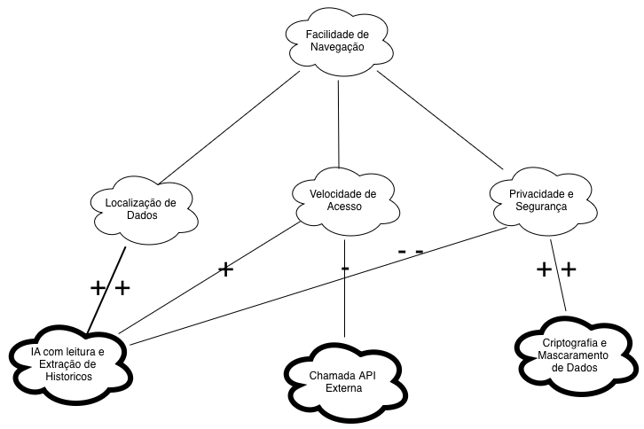

# SIG (NFR Framework)

Nesta seção, apresenta-se a versão finalizada do **Softgoal Interdependency Graph (SIG)** utilizando a notação do **NFR Framework** para a avaliação dos requisitos não-funcionais do sistema.

### Legenda e Tipos de Elementos do SIG

- **Softgoals de Requisito (Nuvem de Borda Fina):** Objetivos de qualidade (ex.: *Usabilidade*, *Segurança*, *Desempenho*).
- **Operacionalizações (Nuvem de Borda Grossa):** Soluções técnicas e escolhas de arquitetura (ex.: *Autenticação Gov.br*, *Criptografia TLS*, *Mascaramento de Dados*).
- **Claims (Nuvem Tracejada):** Justificativas e argumentos de projeto.
- **Tipos de Contribuição:**
  - **`++` (Make):** Satisfaz fortemente o softgoal.
  - **`+` (Help):** Contribuição positiva parcial.
  - **`-` (Hurt):** Prejudica parcialmente o softgoal.
  - **`--` (Break):** Compromete severamente o softgoal.

---

### Participantes
| Nome do Membro |
| :--- |
| [Gustavo Fornaciari](https://github.com/GUGOFO) |

### Metodologia
O trabalho foi focado na identificação e decomposição de requisitos não-funcionais críticos para o sistema. Para esta versão, concentramos os esforços na qualidade de proteção às informações dos usuários utilizando a notação do NFR Framework.

### NFR Framework
SIG de Privacidade na notação do NFR Framework.

**Estrutura Modelada:**
- **Nó Principal (Softgoal de Requisito):** Privacidade
- **Nós de Especialização:**
  1. Proteção de Dados Pessoais
  2. Consentimento do Usuário

## Histórico de Versionamento

### Versão 1.0 (v1)

#### Quem fez a versão
- [Gustavo Fornaciari](https://github.com/GUGOFO)

#### O que mudou da versão anterior
- Definição inicial do escopo de requisitos não-funcionais (NFR) e mapeamento dos Softgoals principais.

---

### Versão 2.0 (v2)
#### Quem fez a versão
- Integrantes da SubEquipe 01

#### O que mudou da versão anterior
- Decomposição dos Softgoals em sub-softgoals e identificação das operacionalizações técnicas aplicáveis.

---

| Nome do Membro | Contribuição | Data |
| :--- | :--- | :--- |
| [Gustavo Fornaciari](https://github.com/GUGOFO) | Adicionando SIG versão 1 | 27/08/2026 |
| [Gustavo Fornaciari](https://github.com/GUGOFO) | Adicionar primeira versão a nova pagina| 27/08/2026 |
