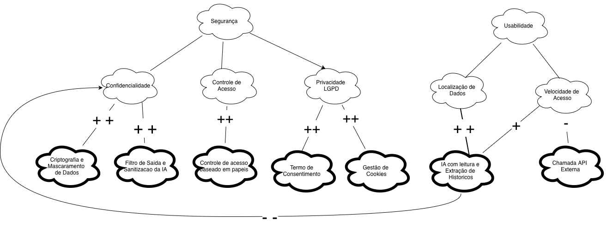

# SIG (NFR Framework)

Nesta seção, apresenta-se a versão finalizada do **Softgoal Interdependency Graph (SIG)** utilizando a notação do **NFR Framework** para a avaliação dos requisitos não-funcionais do sistema.

### Legenda e Tipos de Elementos do SIG

- **Softgoals de Requisito (Nuvem de Borda Fina):** Objetivos de qualidade
- **Operacionalizações (Nuvem de Borda Grossa):** Soluções técnicas e escolhas de arquitetura
- **Claims (Nuvem Tracejada):** Justificativas e argumentos de projeto.
- **Tipos de Contribuição:**
  - **`++` (Make):** Satisfaz fortemente o softgoal.
  - **`+` (Help):** Contribuição positiva parcial.
  - **`-` (Hurt):** Prejudica parcialmente o softgoal.
  - **`--` (Break):** Compromete severamente o softgoal.

---

### Participante
| Nome do Membro |
| :--- |
| [Gustavo Fornaciari](https://github.com/GUGOFO) |

### Metodologia
O trabalho focou na identificação, decomposição e análise de impactos de requisitos não-funcionais críticos para o sistema. Para esta versão, concentramos os esforços nas dimensões de **Segurança** e **Usabilidade**, aplicando a notação do *NFR Framework* para evidenciar soluções técnicas (operacionalizações) e seus *trade-offs*.

### NFR Framework
Gráfico de Interdependência de Softgoals (SIG) construído na notação do NFR Framework.

**Estrutura Modelada:**

* **Nós Principais (Softgoals):**
  * **Segurança:** Focado na proteção, integridade e governança das informações do usuário.
  * **Usabilidade:** Focado na eficiência, agilidade e facilidade de navegação.

* **Nós de Decomposição (Sub-Softgoals):**
  1. **Confidencialidade:** Garantia de proteção contra o vazamento de dados sensíveis.
  2. **Controle de Acesso:** Restrição de recursos e funcionalidades com base em permissões de usuário.
  3. **Privacidade (LGPD):** Conformidade com os direitos de transparência, tratamento e consentimento de dados.
  4. **Localização de Dados:** Facilidade para o usuário encontrar informações históricas e registros.
  5. **Velocidade de Acesso:** Agilidade no tempo de resposta do sistema.

* **Operacionalizações (Soluções Técnicas):**
  * *Criptografia e Mascaramento de Dados* (`++` em Confidencialidade)
  * *Filtro de Saída e Sanitização da IA* (`++` em Confidencialidade)
  * *Controle de Acesso Baseado em Papéis (RBAC)* (`++` em Controle de Acesso)
  * *Termo de Consentimento* (`++` em Privacidade LGPD)
  * *Gestão de Cookies* (`++` em Privacidade LGPD)
  * *IA com Leitura e Extração de Históricos* (`++` em Localização de Dados, `+` em Velocidade de Acesso)
  * *Chamada API Externa* (`-` em Velocidade de Acesso)

## Histórico de Versionamento

### Versão 1.0 (v1)

#### Quem fez a versão

- [Gustavo Fornaciari](https://github.com/GUGOFO)

#### O que mudou da versão anterior
- Definição inicial do escopo de requisitos não-funcionais (NFR) e mapeamento dos Softgoals principais.

---

### Versão 2.0 (v2)

#### Quem fez a versão

- [Gustavo Fornaciari](https://github.com/GUGOFO)
- [Ana Beatriz](https://github.com/AnnaBeatrizAraujo) 
- [Victor Leandro](https://github.com/Afrontoso)

#### O que mudou da versão anterior

* **Separação de Softgoals Raiz:** Divisão em dois domínios independentes (**Segurança** e **Usabilidade**).
* **Decomposição da Segurança:** Desmembramento em **Confidencialidade**, **Controle de Acesso** e **Privacidade (LGPD)**.
* **Novas Operacionalizações:** Inclusão de Sanitização da IA, RBAC, Termo de Consentimento e Gestão de Cookies.
* **Ajuste no Trade-off:** O conflito negativo (`--`) da IA agora aponta diretamente para **Confidencialidade**.

---

| Nome do Membro | Contribuição | Data |
| :--- | :--- | :--- |
| [Gustavo Fornaciari](https://github.com/GUGOFO) | Adicionando SIG versão 1 | 27/08/2026 |
| [Gustavo Fornaciari](https://github.com/GUGOFO) | Adicionar primeira versão a nova pagina| 27/08/2026 |
| [Gustavo Fornaciari](https://github.com/GUGOFO) | Adicionar contribuicoes da Ana e Victor para V2| 28/08/2026 |
