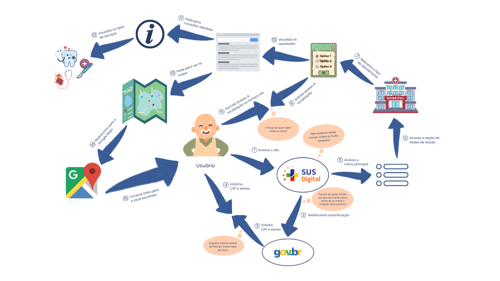
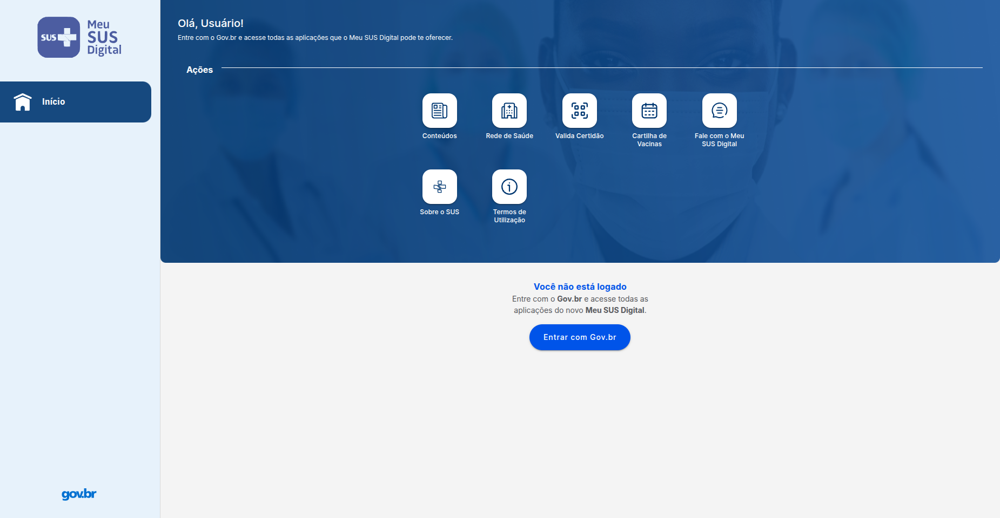
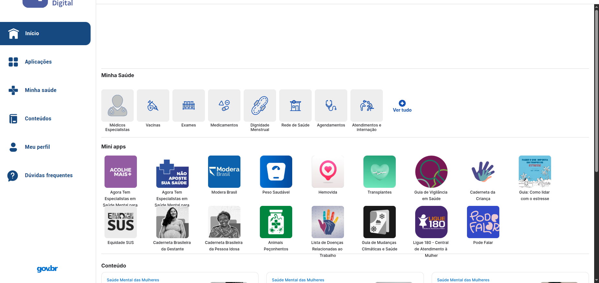
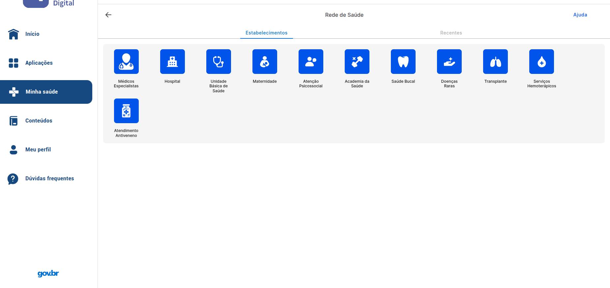
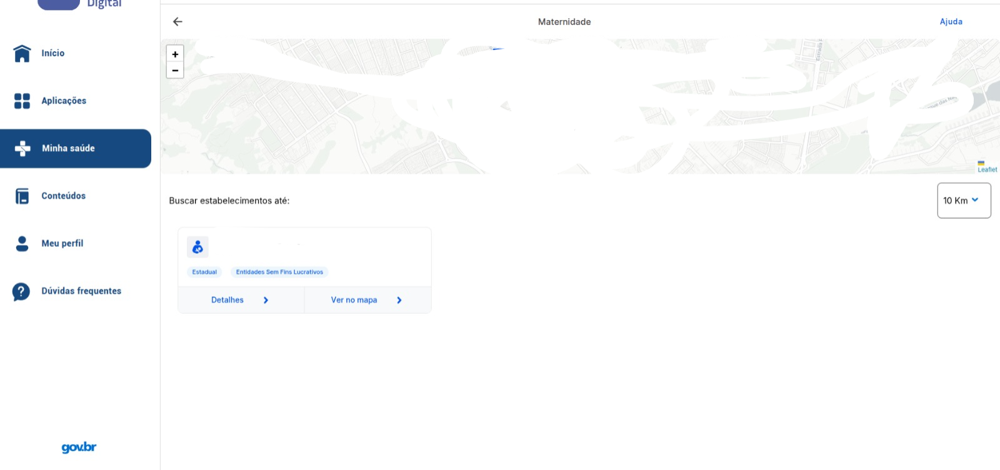
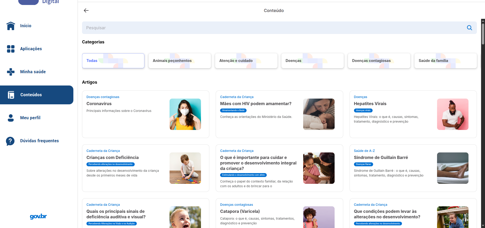
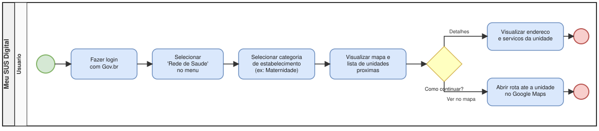
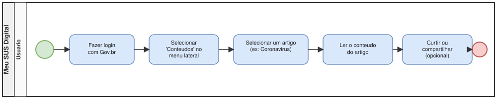

# SubEquipe_03
## Focos do Relatório:
### FOCO_01: Artefatos Generalistas & NFR Framework
#### Participantes no Foco_01
| Nome do Membro |
|   --- |
| Gabriel Mota Oliveira |
| Yasmim de Souza Santos |

#### Metodologia do Foco_01
Espaço para contar um pouco sobre como ocorreu o trabalho em equipe. Vídeos ajudam aqui.
### Rich Picture

Arquivo editável: [Rich Picture Usabilidade](https://canva.link/5nzidpjb7mkkt9k)

#### Legenda da Rich Picture: Fluxo de Busca de Rede Credenciada no Meu SUS Digital

##### Convenção geral:
- **Setas numeradas (1-15):** sequência cronológica de interações entre o usuário e o sistema, do login até a obtenção da rota até o atendimento.
- **Balões de fala (nuvens):** preocupações de usabilidade (concerns) expressas pelo usuário em cada etapa do fluxo.
- **Personagem central:** usuário idoso, escolhido propositalmente para evidenciar barreiras de usabilidade em um perfil de baixo letramento digital.

##### Sequência de interações

| Nº | Ação | Descrição |
|---|---|---|
| 1 | Acessa o site | Usuário entra na plataforma Meu SUS Digital |
| 2 | Redireciona autenticação | Sistema encaminha o usuário para o login via gov.br |
| 3 | Solicita CPF e senha | gov.br pede as credenciais |
| 4 | Informa CPF e Senha | Usuário preenche os dados de login |
| 5 | Acessa o menu principal | Usuário retorna à plataforma já autenticado |
| 6 | Acessa redes de saúde | Usuário navega até a seção de busca de estabelecimentos |
| 7 | Seleciona o tipo de atendimento | Usuário escolhe a categoria de necessidade (emergência, maternidade, especialista etc.) |
| 8 | Solicita acesso à localização | Sistema pede permissão de geolocalização |
| 9 | Permite acesso à localização ou fornece ela | Usuário autoriza o uso do GPS ou digita o endereço manualmente |
| 10 | Visualiza os resultados | Lista de estabelecimentos compatíveis é exibida |
| 11 | Pede para consultar detalhes | Usuário solicita mais informações sobre um resultado |
| 12 | Visualiza os tipos de serviços | Detalhamento das especialidades/serviços oferecidos pelo estabelecimento |
| 13 | Pede para ver no mapa | Usuário solicita visualização geográfica do local |
| 14 | Redireciona para o Google Maps | Sistema integra com aplicativo externo de mapas |
| 15 | Fornece rotas para o local escolhido | Google Maps entrega o trajeto até o estabelecimento |

##### Preocupações de usabilidade (balões de pensamento)

| Preocupação | Onde aparece | Problema de usabilidade evidenciado |
|---|---|---|
| *"Esqueci minha senha do Gov.br, travei aqui de novo"* | Etapa 3 (login) | Falta de prevenção/recuperação de erro; barreira de autenticação para usuários com baixo letramento digital |
| *"Preciso de ajuda AGORA, por que tem tanto passo antes de eu achar o hospital mais próximo?"* | Etapa 2 (pós-login) | Baixa eficiência do fluxo em cenários de urgência; excesso de passos para uma tarefa crítica |
| *"Não entendo esses ícones, a letra é muito pequena"* | Etapas 7-8 (seleção de atendimento/localização) | Falta de reconhecimento visual e legibilidade inadequada para público idoso |

##### Elementos gráficos e seu significado

- **SUS Digital / gov.br:** sistemas envolvidos na autenticação e navegação.
- **Ícone de menu (linhas horizontais):** representa o menu principal da plataforma.
- **Hospital:** representando a seção de Rede de Saúde.
- **Ícone "i" (informação):** tela de detalhes do estabelecimento selecionado.
- **Ícones de dente, coração e cruz médica:** tipos de serviços/especialidades disponíveis (ex.: saúde bucal, cardiologia, emergência).
- **Mapa / Google Maps:** integração externa para visualização geográfica e cálculo de rota.

#### Embasamento teórico para criação:
1. DE MONTFORT UNIVERSITY. CTEC2402 Software Development Project: introducing rich pictures. Leicester: De Montfort University.
2. MONK, Andrew; HOWARD, Steve. The rich picture: a tool for reasoning about work context. Interactions, New York, v. 5, n. 2, p. 21-30, mar./abr. 1998.
3. SERRANO, Maurício; LEITE, Julio Cesar Sampaio do Prado. A social interaction based pre-traceability for i* models. In: INTERNATIONAL I* WORKSHOP, 5., 2011. CEUR Proceedings of the 5th International i* Workshop (iStar 2011). [S. l.]: CEUR-WS, 2011. p. 132-137.

### NFR Framework

Arquivo editável: [SIG_Usabilidade.drawio](https://viewer.diagrams.net/?tags=%7B%7D&lightbox=1&highlight=0000ff&edit=_blank&layers=1&nav=1&title=SIG_Usabilidade&dark=0#R%3Cmxfile%3E%3Cdiagram%20name%3D%22P%C3%A1gina-1%22%20id%3D%22czpdueMdJo24robT8H2u%22%3E5Vtbc5s4FP41PDqDENdH22l2O9PtpJPJbvMog2yrlREVcmLvr18Bwlx8iR0jyDYvDjqII%2Bk79wMx4HS1%2BYOjZPkXizA1LDPaGPDWsCxgQyj%2FZJRtQfGBVRAWnERqUkV4IP9iRTQVdU0inDYmCsaoIEmTGLI4xqFo0BDn7KU5bc5oc9UELfAe4SFEdJ%2F6D4nEUp3C8ir6n5gsluXKwA2KOytUTlYnSZcoYi81EvxkwClnTBRXq80U0wy8Epfiubsjd3cb4zgW5zwg%2BK%2FH%2B2%2Brr09P7Ntnd47Npx%2BzkVNwwdEeChVbRUrZmof4BK9yntiW4HG2jiOcrW8acMK4WLIFixH9wlgiiUASf2AhtkrsaC2YJC3Fiqq7OI7GmRDlMGYxLih3hFLFUikE4gssTuzM2sEt9RSzFRZ8K5%2FjmCJBnpsnR0phFrt5FabyQsF6AcTuh4AYDgmx%2FyEg9oaE%2BASiFVKSj%2FTL2QGls0syYkjZWrKdvCyJwA8JyqF%2FkaGiiVDB6RnRteJkWC6Vy0wi8iwvF9nlY4pmhJIIRbi8K09Sm6CYYC7wprbDfcSWDYet3PNL5d2Bq2iKDSxdeOeoWv2ieofCHYJm%2FvOYsrfBZr0OW4msivzA14UitC%2Bw%2F97t%2BoBWz5ncVX0v7q81K2%2BM0ny9sZwAzWST8ynvl6o%2BqllAwawygSs8hHr0npF8f6X6%2B%2BDGtGFgB7brmjbwG2KFpncTmLbvubbn2MC0nSb%2FwuEqlvX0pL2KDeUqAQws24XQ9d3GKjawbgCwgWd6luNBF8DmKoXz3FslV6cdEldoWJdBHL7bCAMdfSprWBM9Snud6xg8rP2NKQvrPtlFq4xNPEuTAr6DoW6PzzjEaebMu4uMZ7j4XWQsfXygy8eDS3z8qzle0L0JptK6RMsIc1rNDF8zU4pmmE5Q%2BHORb2fKKOO1uRsivmczbxxHDZ%2FyYVAObzflQtlgWxvcY06kIDC%2FzCEA0EMMa%2FoC83hs6y%2FkBW5Tr12npddHolpX8cbqsqLx3m28AYOWNFbwMUD2Bw2w5scAORgSZO84pDqymDzVIFUxrim58P3ekgu93Y1UcPZz1z52zkwMD4XHGD3jBTKm0Bh7%2BS9kJxLGI9HzdB55aNlEpiHSCHBIUcS0LIB4SBC9kLWuvoXVympdW1vnwuoyqx3APR7JWCM8R2taSen1ylNjoplXnub7rD9Bz677gD3K0iDESdun9Glwu%2By6bPaY2vqtsEt78%2F%2B%2F9lZKRVNhd6KIGzDf77SFMIDwz5WtNSjKyqOpF%2FJoVsJj7oN9Ukx1%2Fycl9iXT%2FCZeiJJFnDlDyTDrbEwy30RCRMfqxopEUcZjwrHUW7UVM09oZOGen9yZGM7t%2BYZ1ScqmzYSucs4HtUA9Yt5A0Gq8jy7unXit54MmAzafp1hL06Q0yb5i6VQKBWcRczKO9L1Fa1dB%2BoJjKam%2B8Pt6qJjRldMDq7cc44CjG7yYHK9THMsSy7jqHYOUihgJNkoTjMNlz1niXk9WW1VmWb%2BvBDmK1i2TM%2FHqzfwomXGJf7%2Ba4Ju91eeDN4bGVLAim5KiS4W%2BbpsT9Aaq3peuZ4A6RZzL0LOSy%2B9q3Rnf6XRB1oSzZbcCEdCGszM0zgfdmJCbkUn6uU3M0%2F6H5wxAQiLUsxOy2wmFPjnq7RG9TY4Hk7c3CvFzLNZE1iR9ixD0JsEuX%2BdCLW1eecz6twXZuP5xQTauvi7IR9v6qP19QZcfbv9OXWE5rL74Lwrf6v8m4Kf%2FAA%3D%3D%3C%2Fdiagram%3E%3C%2Fmxfile%3E)

#### Legenda do SIG

| Categoria | Símbolo / Elemento Visual | Texto Original | Tradução (Português) |
| :--- | :--- | :--- | :--- |
| **Softgoals** | Nuvem com borda fina | NFR Softgoal | Softgoal de NFR (Requisito Não-Funcional) |
| | Nuvem com borda grossa | Operationalizing Method | Método de Operacionalização |
| | Nuvem com borda tracejada | Claim | Argumento (ou Afirmação) |
| | `!` | Critical | Crítico |
| | `✓` | Accepted | Aceito |
| | `X` | Rejected | Rejeitado |
| **Interdependência**  *(Interdependency)* | Seta com linha contínua | Implicity | Implícito |
| | Seta com linha tracejada | Explicity | Explícito |
| | `++` | Strongly positive satisficing | Satisfação fortemente positiva |
| | `+` | Positive satisficing | Satisfação positiva |
| | `-` | Negative satisficing | Satisfação negativa |
| | `--` | Strongly Negative satisficing| Satisfação fortemente negativa |

### FOCO_02: Engenharia Reversa & Modelagem BPMN
Entrega Mínima: um modelo, na notação BPMN, do fluxo do software encontrado com a Engenharia Reversa.
Mira-se no MM no FOCO, com a entrega mínima.
### Participantes no Foco_02
| Nome do Membro |
| --- |
| Davi Ursulino de Oliveira |

### Metodologia do Foco_02
Espaço para contar um pouco sobre como ocorreu o trabalho em equipe. Vídeos ajudam aqui.
### Processo de Engenharia Reversa Aplicado

**Sistema escolhido:** [Meu SUS Digital](https://meususdigital.saude.gov.br) (portal de serviços de saúde do Governo Federal), autenticado via conta Gov.br.

**Contexto:** como não há acesso ao código-fonte do sistema, foi aplicada a Engenharia Reversa conforme definição de Rosana Braga (SCE 186 - USP): "processo de exame e compreensão do software existente, para recapturar ou recriar o projeto e decifrar os requisitos atualmente implementados pelo sistema, apresentando-os em um nível ou grau mais alto de abstração". Partindo do sistema já implementado (baixo nível de abstração), foram reconstruídos os fluxos de uso em um nível mais alto de abstração (o modelo BPMN).

**Ferramenta utilizada:** navegação manual e direta no sistema em produção (captura de tela de cada etapa), já que não há documentação, manual de usuário ou código-fonte disponível publicamente para análise estática.

**Fluxos mapeados:** foram reconstruídos 2 fluxos distintos, a partir da tela inicial (Home) comum aos dois:

#### Fluxo 1 - Rede de Saude

Passo a passo reconstruído via engenharia reversa:

| # | Tela | Print |
|---|---|---|
| 1 | Home (deslogado) |  |
| 2 | Login Gov.br |  |
| 3 | Home (logado) |  |
| 4 | Categorias de "Rede de Saude" |  |
| 5 | Resultado ao escolher "Maternidade" (mapa + lista) |  |

Nesse ponto o usuário tem 2 opções: ver os **Detalhes** da unidade (endereço e serviços) ou **Ver no mapa** (abre rota no Google Maps).

#### Fluxo 2 - Conteudo

Passo a passo reconstruído via engenharia reversa (compartilha os passos 1-3 acima):

| # | Tela | Print |
|---|---|---|
| 4 | Lista de artigos em "Conteudos" |  |
| 5 | Artigo aberto (ex: Coronavirus), com opcao de curtir/compartilhar |  |

### Modelagem BPMN

Modelos elaborados seguindo a notação BPMN apresentada em aula (piscina, raia, eventos de início/fim, atividades nomeadas com verbo no infinitivo, gateway exclusivo para pontos de decisão). Fonte editável (`.drawio`, importável em [app.diagrams.net](https://app.diagrams.net/)) disponível junto de cada imagem.

#### BPMN - Fluxo Rede de Saude

Arquivo editável: [rede-de-saude.drawio](assets/subequipe03-fluxos/fluxo-rede-de-saude/rede-de-saude.drawio)

#### BPMN - Fluxo Conteudo

Arquivo editável: [conteudo.drawio](assets/subequipe03-fluxos/fluxo-conteudo/conteudo.drawio)

#
### FOCO_03: IA Generativa
Entrega Mínima: pontos de vista de cada membro da equipe sobre as lições aprendidas e uso da IA Generativa.
TODOS DEVEM PARTICIPAR!
### Participantes no Foco_03
| Nome do Membro | Lições Aprendidas | Uso da IA Generativa (SENSO CRÍTICO) |
| --- | --- | --- |
| Davi Ursulino de Oliveira | Aprendi na prática o processo de Engenharia Reversa aplicado a um sistema sem acesso ao código-fonte (Meu SUS Digital): naveguei manualmente pelos fluxos de "Rede de Saude" e "Conteudo", documentando cada tela via print, para depois reconstruir esse conhecimento em um nível mais alto de abstração usando a notação BPMN (piscina, raia, eventos de início/fim, atividades em verbo, gateway exclusivo). | Usei IA Generativa como apoio para entender os conceitos (BPMN, NFR/SIG, engenharia reversa) e montar a documentação. Na primeira tentativa, a IA modelou o BPMN com duas raias artificiais ("Usuário" e "Sistema"), duplicando cada passo — um padrão que não correspondia aos exemplos reais da professora (que usam raias apenas para participantes/papéis distintos de fato). Só percebi o exagero ao comparar com os slides da aula e pedi correção, refazendo com uma raia só. Isso reforçou que a IA acelera bastante a montagem dos artefatos, mas a validação crítica (comparar com o material da disciplina, testar o resultado de fato) continua sendo responsabilidade minha. |
| Yasmim de Souza Santos | Aprendi que criar rich pictures voltados para usabilidade de um sistema já existente exige um esforço diferente do uso clássico da técnica: em vez de captar preocupações reais de stakeholders em entrevistas ao vivo, precisei colocar o usuário no centro do desenho e inferir, a partir da observação do fluxo, as frustrações plausíveis em cada etapa, só assim pontos de atrito como excesso de passos, dependência de login externo e ícones pouco legíveis se tornam visíveis antes de qualquer solução técnica ser proposta. | Usei IA Generativa para auxiliar meu conhecimento na criação da Rich Picture, principalmente de forma a entender exatamente o que deveria ser feito e como deveria ser feito, e na organização de pensamentos. |

---

| Nome do Membro | Contribuição | Data |
| -- | -- | -- |
| [Gustavo Fornaciari](https://github.com/GUGOFO) | Criação do Repositorio | 17/08/2026 |
| [Davi Ursulino de Oliveira](https://github.com/DaviUrsulino) | Engenharia Reversa dos fluxos "Rede de Saude" e "Conteudo" (Meu SUS Digital), modelagem BPMN dos dois fluxos, e ponto de vista sobre o uso de IA Generativa (Foco_03) | 25/08/2026
| [Yasmim de Souza Santos](https://github.com/eii-yahs) | Criação da Rich Picture (Foco_01) e ponto de vista sobre o uso de IA Generativa (Foco_03) | 26/08/2026 |