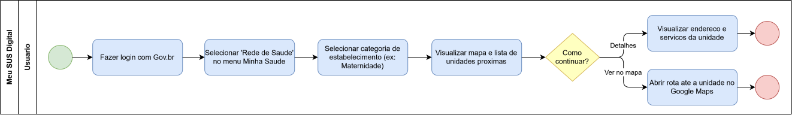
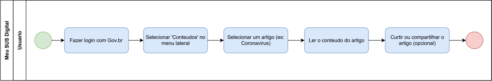

# Engenharia Reversa & Modelagem BPMN - Foco_02

Entrega Mínima: um modelo, na notação BPMN, do fluxo do software encontrado com a Engenharia Reversa.
Mira-se no MM no FOCO, com a entrega mínima.

## Participantes no Foco_02

| Nome do Membro            |
| ------------------------- |
| Davi Ursulino de Oliveira |
| Gabriel Mota Oliveira     |

## Metodologia do Foco_02

Espaço para contar um pouco sobre como ocorreu o trabalho em equipe. Vídeos ajudam aqui.

## Processo de Engenharia Reversa Aplicado

**Sistema escolhido:** [Meu SUS Digital](https://meususdigital.saude.gov.br) (portal de serviços de saúde do Governo Federal), autenticado via conta Gov.br.

**Contexto:** como não há acesso ao código-fonte do sistema, foi aplicada a Engenharia Reversa conforme definição de Rosana Braga (SCE 186 - USP): "processo de exame e compreensão do software existente, para recapturar ou recriar o projeto e decifrar os requisitos atualmente implementados pelo sistema, apresentando-os em um nível ou grau mais alto de abstração". Partindo do sistema já implementado (baixo nível de abstração), foram reconstruídos os fluxos de uso em um nível mais alto de abstração (o modelo BPMN).

**Ferramenta utilizada:** navegação manual e direta no sistema em produção (captura de tela de cada etapa), já que não há documentação, manual de usuário ou código-fonte disponível publicamente para análise estática.

**Fluxos mapeados:** foram reconstruídos 2 fluxos distintos, a partir da tela inicial (Home) comum aos dois:

### Fluxo 1 - Rede de Saude

Passo a passo reconstruído via engenharia reversa:

| #   | Tela                                               | Print                                                                                                   |
| --- | -------------------------------------------------- | ------------------------------------------------------------------------------------------------------- |
| 1   | Home (deslogado)                                   |                      |
| 2   | Login Gov.br                                       |                           |
| 3   | Home (logado)                                      |                            |
| 4   | Categorias de "Rede de Saude"                      |          |
| 5   | Resultado ao escolher "Maternidade" (mapa + lista) |  |

Nesse ponto o usuário tem 2 opções: ver os **Detalhes** da unidade (endereço e serviços) ou **Ver no mapa** (abre rota no Google Maps).

### Fluxo 2 - Conteudo

Passo a passo reconstruído via engenharia reversa (compartilha os passos 1-3 acima):

| #   | Tela                                                              | Print                                                                                 |
| --- | ----------------------------------------------------------------- | ------------------------------------------------------------------------------------- |
| 4   | Lista de artigos em "Conteudos"                                   |  |
| 5   | Artigo aberto (ex: Coronavirus), com opcao de curtir/compartilhar |    |

## Modelagem BPMN

### O que é o BPMN

BPMN (Business Process Model and Notation) é uma notação gráfica utilizada para representar e modelar processos de forma padronizada, descrevendo como as atividades de um processo são organizadas, executadas e relacionadas entre si. Enquanto uma descrição textual apresenta o processo de maneira sequencial, a BPMN permite visualizar explicitamente elementos como eventos, atividades, decisões, participantes e seus respectivos fluxos, facilitando a compreensão do comportamento de um sistema ou processo. A especificação BPMN 2.0 da Object Management Group (OMG, 2011) define esses elementos e suas regras de representação. Dessa forma, a BPMN funciona como uma linguagem comum para analisar e comunicar processos, tornando sua estrutura, responsabilidades e diferentes caminhos mais claros e sistemáticos.

Para mais informações sobre: [Guia BPNM](../../../Projeto/GuiaBPMN.md)

### Porque usar o BPMN

A utilização da análise de fluxo em BPMN nos fluxos abaixo foi escolhida por permitir representar, de forma padronizada e visual, a sequência de atividades, os eventos que iniciam e encerram os processos, as responsabilidades dos participantes e os pontos de decisão existentes no sistema. Conforme a especificação BPMN 2.0 da OMG (2011), esses elementos possibilitam estruturar processos de negócio de maneira compreensível e sistemática. Além disso, Serrano et al. (2026) destaca o uso de piscinas, raias, atividades nomeadas com verbos no infinitivo e gateways com perguntas explícitas para representar responsabilidades e decisões no fluxo. Assim, a BPMN possibilita evidenciar, nos dois processos analisados, o encadeamento das ações e, no caso da Rede de Saúde, as diferentes alternativas disponíveis ao usuário, tornando os fluxos mais claros e passíveis de análise.

### BPMN - Fluxo Rede de Saude

Fonte editável (`.drawio`, importável em [app.diagrams.net](https://app.diagrams.net/)) disponível junto de cada imagem.

Arquivo editável: [rede-de-saude.drawio](https://viewer.diagrams.net/?tags=%7B%7D&lightbox=1&highlight=0000ff&edit=_blank&layers=1&nav=1&dark=auto#R%3Cmxfile%3E%3Cdiagram%20name%3D%22Fluxo%20-%20Rede%20de%20Saude%22%20id%3D%22rede-saude%22%3E3ZlNk5s4EIZ%2FjSvJZcsgYJhj4vnYy1zWlewxJVAbVCtolxBjz%2Fz6lUDYEMiHjeyaZA4MtFqCfl7RauEFWRX7R0m3%2BRMyEAt%2FyfYLcrfwfW95E%2Bt%2FxvLSWsIb0hoyyZl1OhrW%2FBW6ntZacwbVwFEhCsW3Q2OKZQmpGtiolLgbum1QDO%2B6pRmMDOuUirH1X85Ubq3hcnls%2BBt4lttb%2B5FtKGjnbA1VThnueiZyvyAriajas2K%2FAmHgdVzafg%2FfaT08mIRS%2FUqHrcY27mOHqdRLF3G144Wgpb76lKPkr1gqKnTTUht2OVew3tLU%2BO604sZJFabZ06eVolJZDYnxbwd%2FpqK2gz9BrQ3rz2t9vOMZN0O3PiAV7HvPZIN4BCxAyRftkvcwe7eW6q4nCulQUyt6duh85KJPLJppTCb0r3VVU8lxjOsI8VrEPvcfxQUlvzPacYgDaE0YY1pjlj1qegT9EsPPGW24ECsUKJt%2BhIUQs6BhJ%2FE%2F6LXEfkKiaAriWfSCMbxgiC60lza33YTzSaqJ9%2FqHGCXWJQNmWZ2IkkK8SadQRmkMyWYK5QN9BalNAjNeNom30MdHfP4rkWdhjibmaDjk7PnBAHTkArT%2FxkGvQUDKsaSG9rt%2FgIFZRs1hTWsG7%2FRJiWahgdLk1Cde5rRrvJQQxPPcC0F%2BJyFSqiDTSZ52YoDOfUnjoYVQRpD3hvlHI4n2lSVnlMGHSylyKERcKhK8cUW%2BcP0ggr82ihR0a8QwWgiuxeiEqVvylQlE4p4XGsmFRIhu3YuQ7U5eCXIskro6WYGN%2FkuXUwqwKInCyQV1hQW2VbfipX6cBXk4C248hvtNeRLHQ7ahiwke0t9phoO%2BtYQU7SyvQD7zFM3EZvQ40S%2B2%2BC6%2FKXN8Jwokb1yBj4nkBr7EJqXoVG6Ofdzt8vuImAlosv32YglmpIHnORBBz6tTc8y5RfsmTiGdVCCJwyCc3PmcBfPnRbt32PFYlsQNylPryT8RpeciN4CdlMBGn2Z%2BiBZrmXY78uN%2BtE9cD7i2lyhVjpku6sT90dqn3vbW42Rgb6m%2Bw0yCoIo%2FD591FgB%2FNgA1%2Fq4zN3r%2FWtGT%2BdH7zqMn14o%2BmB89cR59cK3ow%2FnRB66jt5X4NcKPZod%2F2DY4VL%2BrlnsLyh0oKnKorgXm5m2CSUZgvjQfx9oPM83G9Dp84vnvTaeyOz5dfXkNALcOACQXAHChVVNfHn85atp6v7%2BR%2B%2F8B%3C%2Fdiagram%3E%3C%2Fmxfile%3E)

### BPMN - Fluxo Conteudo

Arquivo editável: [conteudo.drawio](https://viewer.diagrams.net/?tags=%7B%7D&lightbox=1&highlight=0000ff&edit=_blank&layers=1&nav=1&dark=auto#R%3Cmxfile%3E%3Cdiagram%20name%3D%22Fluxo%20-%20Conteudo%22%20id%3D%22conteudo%22%3E1ZhNc5swEIZ%2FjSftoR0jASHHhnz00Jw8mR47MqxBU8EyQthOfn0lkAMUkrYBe9yLLV6tFvbZRSwsaJjt7yUr0geMQSzIMt4v6M2CEOo6RP8Z5alRvEvaCInkcSM5rbDiz2DFpVUrHkPZM1SIQvGiL0aY5xCpnsakxF3fbIOif9aCJTAQVhETQ%2FU7j1VqVbJcthNfgSepPTXx7UTGDsZWKFMW464j0dsFDSWiakbZPgRh4B24NOvuXpl9uTAJufqbBYXGNlxj3ZTq6RBxueOZYLk%2Buk5R8mfMFRN6aqmFXcoVrAoWGdudzrgxUpmZdvSwVEwqm0Nq7BvnWyYq63xBfKHPfB3zrR4mZvgAlbZZPa707w1PuDmbtdLBdAytM5AK9p2Lt9HeA2ag5JM2STv5cK4s%2Fl0ne45nRevnE3EP%2BWS2XpIXdy1SPbBUxwkbaj%2BqsmKS45B0y%2F9UsB%2B7lzILN9LnRmeAVocxpDVk2aGmPej7H%2F7MaMOFCFGgrNfR2IMgdmt2En9CZyYga%2Br74xX7DnruEJ7bR3eoQLstXnrTSaqRLeFNjBKrPIbYsvpHlAyCTTSG0o8CWG%2FGUN6xZ5BaEpjwvN6zM%2F17j9vPa%2FkuzP5Ijf52a7%2BUrAXtzwGanDnoFQiIOObM0L4I9aYCVYzlhT7K0TybIDd7rmAKJBPHQk%2BX3vzo6f%2BEvsrqLkTxxFD%2FYPB%2B0YMQpTbYclmVH48F372i88N3zxz%2Bt3p7waYdrGvedJ7YScJxYPsBmR%2B2d%2Baww0ozrXlXzV5eGMgiZYcctIWPRX1LiKNVe3DpzJ4AyOMTtSWbIIJolP468FzvlUb6KG2Js%2FTnb0zAJgfiwbvWm2SxktGhT267xC5w7XBlD1GqFBNTZbet2oXerNZ%2BElDdhmmITIJ%2BMvJt%2F1onASCTAajhi9rU6MmpoqfToyezR09PFb07PXo6e%2FTuqaL3pkfvzh69d6ro%2FenRe3NHb59r84evD9uvWfVc55sgvf0F%3C%2Fdiagram%3E%3C%2Fmxfile%3E)

## Embasamento teórico para criação:

1. CHIKOFSKY, Elliot J.; CROSS, James H. Reverse engineering and design recovery: a taxonomy. IEEE Software, Los Alamitos, v. 7, n. 1, p. 13-17, jan. 1990. (Trabalho seminal que define Engenharia Reversa como "o processo de análise de um sistema para identificar seus componentes e as relações entre eles, e criar representações do sistema em outra forma ou em um nível mais alto de abstração", base da definição de Rosana Braga citada acima.)
2. OBJECT MANAGEMENT GROUP (OMG). Business Process Model and Notation (BPMN), Version 2.0. Needham: OMG, 2011. Disponível em: https://www.omg.org/spec/BPMN/2.0/. (Especificação oficial da notação BPMN, definindo os elementos de piscina, raia, evento, atividade e gateway utilizados na modelagem.)
3. SERRANO, Milene. Arquitetura e Desenho de Software - Aula: Notação BPMN. Gama: FGA/UnB, 2026, slide 10 (definição de Raia/Lane) e exemplos completos de modelagem (Compra de Refrigerante, Solicitação de Férias, Emissão de CNH). (Material de aula utilizado como referência para o padrão de modelagem seguido: atividades nomeadas com verbo, gateways com pergunta explícita, e raias representando responsabilidades genuinamente distintas por participante/papel/sistema, sem duplicação espelhada de passos.)

---

| Nome do Membro                                               | Contribuição                                                                                                 | Data       |
| ------------------------------------------------------------ | ------------------------------------------------------------------------------------------------------------ | ---------- |
| [Gustavo Fornaciari](https://github.com/GUGOFO)              | Criação do Repositorio                                                                                       | 17/08/2026 |
| [Davi Ursulino de Oliveira](https://github.com/DaviUrsulino) | Engenharia Reversa dos fluxos "Rede de Saude" e "Conteudo" (Meu SUS Digital), modelagem BPMN dos dois fluxos | 26/08/2026 |
| [Gabriel Mota Oliveira](https://github.com/Gabro-MO)         | Correção dos fluxos BPMN e respectivos links (Foco_2)                                                        | 27/08/2026 |
| [Yasmim de Souza Santos](https://github.com/eii-yahs)        | Criação do arquivo separado para o artefato produzido                                                        | 28/08/2026 |
| [Gabriel Mota Oliveira](https://github.com/Gabro-MO)         | Adição explicação do BPMN, sua justificativa de uso e correção da hierarquia de titulos (Foco_2)             | 28/08/2026 |
