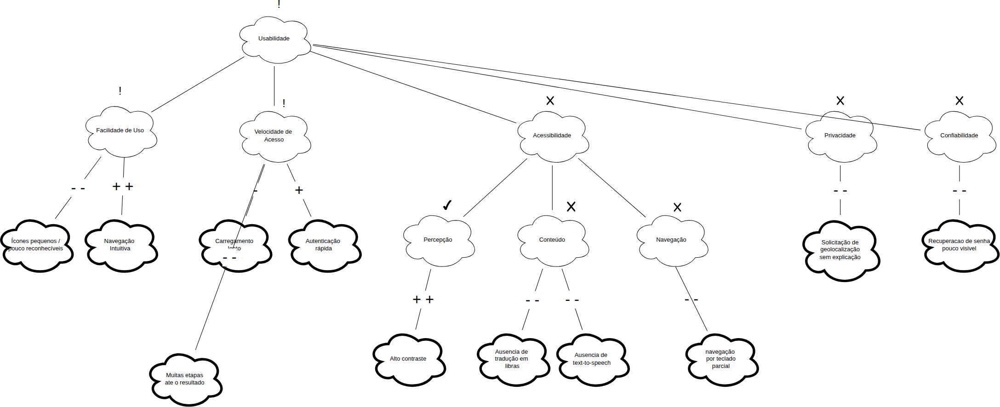

# NFR Framework

## Participantes do artefato

| Nome do Membro            |
| ------------------------- |
| Gabriel Mota Oliveira     |
| Yasmim de Souza Santos    |
| Davi Ursulino de Oliveira |

## O que é um NFR (Requisito Não Funcional)

NFR (Non-Functional Requirement, ou Requisito Não Funcional) é um requisito que não descreve uma função específica que o sistema deve executar, mas sim uma qualidade ou restrição sobre _como_ essas funções devem ser realizadas — por exemplo, usabilidade, segurança, desempenho, privacidade ou acessibilidade. Enquanto um requisito funcional responde "o que o sistema faz" (ex.: "o usuário deve conseguir buscar uma unidade de saúde"), um NFR responde "com que qualidade" isso deve acontecer (ex.: "a busca deve ser acessível a usuários com baixo letramento digital").

Chung et al. (2000) argumentam que NFRs raramente podem ser completamente satisfeitos de forma binária (sim/não): eles são, na prática, _softgoals_, sem um critério de satisfação claro e objetivo, cujo cumprimento é sempre uma questão de grau e de compromisso com outros objetivos do sistema. É justamente por isso que o NFR Framework trata a Usabilidade do Meu SUS Digital não como uma caixa a ser marcada, mas como um softgoal a ser refinado, discutido e avaliado ao longo do processo de design, o que motiva o uso do SIG descrito a seguir.

Para mais informações sobre: [Guia NFR Framework](../../../Projeto/GuiaNFR.md)

## O que é um SIG (Softgoal Interdependency Graph)

O SIG (Softgoal Interdependency Graph, ou Grafo de Interdependência de Softgoals) é a notação gráfica proposta pelo NFR Framework (CHUNG et al., 2000) para representar como um softgoal de alto nível se decompõe em softgoals mais específicos, e como decisões de design concretas impactam essa rede de objetivos. Um SIG é composto principalmente por três tipos de elementos:

- **Softgoals**: os próprios requisitos não funcionais, em diferentes níveis de abstração (ex.: Usabilidade → Acessibilidade → Percepção). Representados como nuvens de borda fina.
- **Métodos de Operacionalização**: decisões concretas de design ou implementação que contribuem — positiva ou negativamente — para um ou mais softgoals (ex.: "Autenticação via CPF e senha"). Representados como nuvens de borda grossa.
- **Claims**: argumentos ou justificativas usados para embasar por que determinada contribuição foi avaliada de certa forma, geralmente quando o contexto importa para a interpretação do link. Representados como nuvens de borda tracejada.

Esses elementos são conectados por **links de contribuição** (rotulados com `++`, `+`, `-` ou `--`), que indicam o quanto um nó filho satisfaz ou prejudica o nó pai, e podem opcionalmente receber avaliações finais (`!` crítico, `✓` aceito, `X` rejeitado) que sintetizam o resultado da análise para cada softgoal.

O valor do SIG está em tornar **explícitas e rastreáveis** as decisões de design e seus trade-offs: como o mesmo método pode satisfazer um softgoal enquanto prejudica outro, e como esse raciocínio pode ser revisitado posteriormente — funcionando como um registro do processo de design, e não apenas do seu resultado final.

## SIG de Usabilidade

### Versão 1

**Autoria: Gabriel Mota**

Estrutura inicial do SIG de Usabilidade: o softgoal _Usabilidade_ foi decomposto em _Facilidade de Uso_, _Velocidade de Acesso_ e _Acessibilidade_ (refinada em _Percepção_, _Conteúdo_ e _Navegação_), conectados aos métodos identificados no Meu SUS Digital por meio dos links de contribuição (`++`, `+`, `-`, `--`). Nesta versão, os nós ainda não têm avaliação final (`!`, `✓` ou `X`) — a análise mostra apenas o sentido de cada contribuição, sem indicar quais softgoals foram aceitos ou rejeitados.

### Versão 2

**Autoria: Yasmim de Souza**

A estrutura de nós e links da Versão 1 foi mantida, e os símbolos de avaliação final foram adicionados a cada softgoal. *Facilidade de Uso* e *Percepção* receberam `✓` (aceito), sustentados por métodos com contribuição fortemente positiva (*Navegação Intuitiva* e *Alto contraste*). *Acessibilidade*, *Conteúdo* e *Navegação* receberam `X` (rejeitado), devido às lacunas de acessibilidade do sistema (ausência de libras, ausência de text-to-speech e navegação por teclado parcial, todas `--`). *Velocidade de Acesso* recebeu `!` (crítico) por um trade-off interno: a contribuição positiva de *Autenticação rápida* (`+`) não compensa a negativa de *Carregamento lento* (`-`). O softgoal raiz *Usabilidade* também recebeu `!`, propagando o resultado misto dos três ramos filhos (um aceito, um crítico, um rejeitado).

> **Nota de revisão** _(Davi Ursulino de Oliveira, 28/08/2026)_: a avaliação `+` de *Autenticação rápida* foi checada cruzando com o Rich Picture do Foco_01 — ver a seção "Rastreabilidade com o Foco_01", abaixo, e a "Versão 3" para as correções aplicadas a partir dessa análise.

Arquivo editável: [SIG_Usabilidade.drawio](https://viewer.diagrams.net/?tags=%7B%7D&lightbox=1&highlight=0000ff&edit=_blank&layers=1&nav=1&title=SIG_Usabilidade_V2&dark=0#R%3Cmxfile%3E%3Cdiagram%20name%3D%22Pagina-1%22%20id%3D%22czpdueMdJo24robT8H2u%22%3E7Vxbd9o4EP41fsRHF1%2FwI5Cm27PdNrs53TaPwhagxraoLRKyv34lI4NtLoEUsELCySHWWIxkfZ9mRiOBhQfJ%2FGNGppO%2FeERjC4FobuErCyEIAyz%2FKcnTQtKFzkIwzlikK60Et%2Bw%2FqoVAS2csonmtouA8FmxaF4Y8TWkoajKSZfyxXm3E43qrUzKma4LbkMTr0u8sEhP9FMhfyf%2BgbDwpW4ZesLiTkLKyfpJ8QiL%2BWBHhDxboWeq6%2FocHGedi6%2B2yUjIf0FgNdjmOuh0LXR%2F%2B2eVjZjQVv69OZL%2B%2B3fydfLm7439%2F8kYU3P0cdtyFQhqtjfiqUS3K%2BSwL6Q5dZT3xVAKV8VkaUdW%2B7FGfZ2LCxzwl8WfOp1IIpfAnFeJJU4zMBJeiiUhifZemUU8RRhZTntKF5JrFsVapyUeyMRU7eoZ2Qdscto%2BUJ1RkT7Kc0ZgI9lAfGqLZO17W2xcSWUejchzwvDcBHr5M8LpvAjz%2FMsHbgdUKA6lHekQ1dNLNTJUwjPlMqu0%2FTpigt1NSgPoonXR97BeaHkg805os5MWymX7EHuTlWF1%2By8mQxSwiES3vyoesVNBKaCbovNLDF2AxqflS7YIeV44Xelqm23HLOjq8WLotc%2FBD58XvmoRLrEDx9i3nJwIIPQ8QAnWAHGAcQNg5wDye3extmJojLntV7Yv3a8bLG528aE8NCwbTeaGnvF%2FO105lGi%2BUrebxKQ3oPrpXLdxwVjxnOdV9aAMHB07geB5wYLfGKxf5dgCcru85vutA4NR7sXBrWuN%2BRHuuOxjL7gQ4QI6Hsdf1at3xMLIhdKAPfNlx7DUGZeHLXtAdzf7l4J99rhwzDsTmxoHu6SafhfotTb%2BWzGvr8cu%2FNOZh1SV6JFFq0mE%2BXQCzMaZZ09MLaa586RlDIHR4CORA4zwsdI65AAmObzZyaRFEw3AUsorpeM60xGRI4z4J78dFdwY85lml7pyJH6qm7bq6eFcUg7J4NS8bUoWnSuGGZkwiSLPDjBiEZ4gg6vYLbI8sXl%2FAAaFbn1ldHxwpqmjbjaNjZgR8Y904vNCUAAreBnzdC42IwNuAL7hM%2BPzzBrRF1MlWCbi24kwIfPMDzdMmS3OR8fvlPqC75%2FJjU6iUkgc6JtYAWz2%2FeMd8x7JkSyS1e7WyqdmpDEnlzKVhTCJ%2BkgZIFjISH6i6NUo7jbVT1zMvO4mOuXZqwVtsWRdFdERmsTggJwNPnJMBby0zA%2F3WUzNyaRvSadMOGmUkuk7dRngGbjHhY9qI7uu1ESU0J0p5gM6bsg%2FIeeW02pc1F3pmpzykps%2FGkWE58GAdxp0EqHoDyYXParbWkSAxG6fKNUiFKk%2FZV5aahSTu6RsJiyKlo59ROdd0V0ARkrJUFEPm9i33an9jcEjQfbJpf1pXtZFfWiewMWxsOnZOlQn1G80E9Xb4aJTTV5YBLc3RuWKfgaQNVRFOvxdxgxbxBkYzJb3OBc2XTWvx1gDC0PxwExiYZenNcpqGjPzeFq%2FEW3QE7%2BRTSsOJcfmKtR0p8%2FIVCF0uOTISzRp2AtDkxfpiNswkcIaRLAjMz4m1nubtxYIvImtJily0mJb3u%2BbDhduGa0CyTPr4RDa%2FzC8Ns%2BU8XIjbQtDBDY%2BPzUPQNdKoC9kZucjcdxtltzXOCgVwyiJimkn2oPkM8Q1kyJeDdtl20%2BNTKmZMLsaNI0fzhL2J5DjmcSN8kj0sOT7V43mqXD2fp8qrA3pF6alaah7RO%2BaXCd%2B3vF7ExNFXisJP%2Fe9fP%2F75c3Z7f3s9uPlnvy%2FjlLnLIs95w3M57bnKYQ65EDzZkNwUvGmutHVL5mP1tWh7SHIW2vIz9ypXKheXxTeVR2yuSKuNW%2BPA6EiSpRTFyiJ0IpLdW%2BrkHgbFy0KDynUgPyMbi5h8sA2qbvXj5TxWA7TJfJ7CgG2yX37dfPnQdmsGDPvANNrsFcCq3EGdBpuc2rNga9EBGfWa9ftti4HwVosBd9iK43MHr3OnefS9kcyEgXHMcd%2BZYyRzGqtmbB5zvFfpqlYeySAfEzRX2MA4tPfajiqxYknxqyVVGDfj%2FCw9tuy1ShRHxUtWKRrrlUQAm1ih%2B3M1EUL9LEtPDSC6ZiFPcztiRBIrye1UbRFekzynItdWoEMeaS5HXhblw17%2FsPOHcalu1akV0VoklNtIxOOu7bumm5DgnVTmkArZnv%2BcoYKw27RUyC7Tp%2BbwCoJ3Yr0ma4UDt8Eq9%2FSUKups%2BSWr8vTH6jfD8If%2FAQ%3D%3D%3C%2Fdiagram%3E%3C%2Fmxfile%3E)

### Versão 3
**Autoria: Davi Ursulino de Oliveira**

A partir da tabela de rastreabilidade acima (ver "Rastreabilidade com o Foco_01"), esta versão fecha duas das lacunas identificadas entre o SIG e as preocupações reais do usuário levantadas na Rich Picture:

- **Nova folha em *Facilidade de Uso*:** *Ícones pequenos / pouco reconhecíveis* (`--`), correspondendo à preocupação *"Não entendo esses ícones, a letra é muito pequena"*. Como *Facilidade de Uso* passou a ter um filho negativo além do positivo (*Navegação Intuitiva*, `++`), sua avaliação final foi corrigida de `✓` (aceito) para `!` (crítico) — mantendo a mesma coerência de propagação já aplicada a *Velocidade de Acesso*.
- **Novo softgoal *Privacidade*:** adicionado como quarto filho direto de *Usabilidade*, com a folha *Solicitação de geolocalização sem explicação* (`--`), correspondendo à preocupação *"Por que ele quer saber onde eu estou?"*. Recebeu avaliação `X` (rejeitado), já que nenhum método de operacionalização no sistema atual mitiga essa falta de transparência.

As duas preocupações restantes da tabela de rastreabilidade (fluxo de recuperação de senha e número de etapas até o resultado) foram incorporadas na Versão 4, a seguir.

Arquivo editável: [SIG_Usabilidade_V3.drawio](https://viewer.diagrams.net/?tags=%7B%7D&lightbox=1&highlight=0000ff&edit=_blank&layers=1&nav=1&title=SIG_Usabilidade_V3&dark=0#R%3Cmxfile%3E%3Cdiagram%20name%3D%22Pagina-1%22%20id%3D%22czpdueMdJo24robT8H2u%22%3E7Vxbd9o4EP41PMKRLF%2FwI5DS7dlum25Ot82jsAWoMZZrC0L661cyMtjG3BLAgpDTk6KxMhL6Ps2MRrIaqDeZf4xxNP6H%2BSRoGMCfN9BdwzAgdJH4T0peFpI2NBeCUUx9VWkleKB%2FiBICJZ1SnySFipyxgNOoKPRYGBKPF2Q4jtlzsdqQBcVWIzwia4IHDwfr0h%2FU52MldQFYPfiL0NFYNb18MMFZZSVIxthnzzkR%2BtAAnYb8XPyHejFjfOPjrNJk3iOBHOxsHFU7DaN%2F%2BN8uv2ZMQv52dTz%2B%2Ff3%2B2%2BTL4yP79skeEvD4a9C0FgqJvzbiq0aVKGHT2CNbdGX1%2BEsGVMymoU9k%2B6JHXRbzMRuxEAefGYuEEArhL8L5i6IYnnImRGM%2BCdRTEvodSRhRDFlIFpI%2BDQKlUpEPxyPCt%2FTM2AZtedg%2BEjYhPH4R5ZgEmNNZcWiwYu9oWW9fSEQdhcpxwLPfBXjoOsFrvwvwnOsEbwtWKwyEHuER5dAJNxNJoRewqVDbfR5TTh4inIL6LJx0cewXmmY4mCpNDcMORDNdn87Ex5H8%2BD3BAxpQH%2Fskeyq%2BZK6CUkJiTua5Hr4Ci3HOlcIsBnjOOV5byVQ7VlZHhRdLt6UPfsZ58etjb4kVSH99T9iJADJ2A2SAIkAm0A4gZB5gHs9u9iqm5pCJXuX7Yv%2BesuxBM0nbk8OCQDRP9WTPs%2FnazE3jhbLVPD6lAd1H96qFe0bT75lNdQe2gIlc0zVtG5iwXeCVZTgtF5htxzYdy4TALPZi4daUxv2Itqs7CInuuMg1TBshu20XumMjowWhCR3giI4juzQoC1%2F2iu4o9i8H%2F%2Bxz5ZhxINI3DrRON%2FkaRrem6VeTea09fvmPBMzLu0QbT6SacJBEC2AqY5o1PR2PJNKXnjEEMg4PgUyonYeF5jEXIO7xzUYiLAIvGY5UljMdu0xLgAck6GLvaZR2p8cCFufqzin%2FKWu2LEsVH9OimxXv5llDsvCSK9yTmAoESXyYEYPwDBFE0X6BzZHF5QUcEFrFmdV2wJGiirrduHHMjICjrRuHV5oSMNz3AV%2F7SiMi8D7gc68TPue8AW0addJVAq6uOBMCR%2F9A87TJ0oTH7Gm5D2jtufyoCpVCPCMj3OihRsdJfyO2ZVmyIZLavlqpajYSIamYucQLsM9O0gCOPYqDA1XXRmmztHZq2%2FplJ41jrp1q8BYb1kU%2BGeJpwA%2FIycAT52TAe8vMQKf21IxY2nokKttBrYxE2yzaCFvDLSZ0TBvRvlwbkUFzopQHaL4r%2B2CYF06rfVlzpWd2DKdwNg4PsoEH6zBuJUDeGwgufJaztYgEDugolK5BKJR5yq601NTDQUc9mFDflzq6MRFzTXUFpCEpDXk6ZFa3Yd3tbwwOCbpPNu1P66oq%2BaV0ghaCpU3H5qkyoU6pGbfYDhsOE3JhGdDMHJ0r9ukJ2hAZ4XQ7PtNoEa9hNJPR61zQfKlai9cGEIL6h5tAwyxLZ5qQ0KP4bVu8Am%2Fe5KyZRIR4Y%2B3yFWs7UvrlKwzjeskRY39ashOATF6tL6CDWACnGclcV%2F%2BcWO1p3k7A2SKyFqRIeI1peaetP1yobrh6OI6Fj5%2BI5pf5pUG8nIcLcV0Imqjk8ZF%2BCFpaGnUuOiMWmftuo2y3xnGqAEbUx7qZZBvqzxBHQ4Z8OWiXbTs9PoV8SsViXDtylE%2FY60iOYx43QifZwxLjkz%2BeJ8v583myvDqgl5Ze8qXyEb1jvkx42%2FJ6FROHX4nhfer%2B%2BPrx71%2FTh6eHfu%2F%2B3%2F1expGLwCI%2FqqzTwiSVjnkOBcQl0QGp0QKN3wy9gTZCD7eAfnwrhtaNWNmGlda1yLZ0Yw66MUdH5lilfCZ0gW7MsW7M0ZI5pYUz0o859j7MyaBNd%2BXuWSKCVCYhHjDO2aQCe87KwbWKxSfzkbzEozXACfVa4m%2BeJJWSaHGvxpDOJU92c7AhBj%2F9qSbUKdCuCpOdYlarvMgG2qG9145UhhWdpBeX5GGsxnknPTZstwoUh%2BmPqJI21smIAKpYofpzN%2BZc3szSkQNo9KnHwqTlUyyINUlaodwl7OMkITxRVqCJn0kiRl4UxZft%2F2wls1GmbtWpFdFqJJRVysWjdsuxdDch7o1U%2BpDKaNnOLkMFYbtsqYxWlkHVh1cQ3Ih1SdYKuVaJVWdYYR3GMx%2FPaDMmM0qem1qe4%2B%2BhRvtOcIQksmvk95SELFGDtW8aMWJTj6V5EqFoTLw0LXk3I1S7fUCtdiXy3DA0up1jLaO5M31prKf%2BKoh%2FO8D6BoKc%2BcaB%2B5jOsFf321m2pdPbWXk4zIuer3D7fEVXNXOsW1B3SUGdk734ocX6M08kW8P47YEF1KO8vB8MNt9qt6ZCjGfABJPpH7zXO0trChJ5XAyQeRRUnFs4X%2FhnVuXLyg7FtDQNAJ1LcSgVQckmP2Lf4r4yL1L5hquQs9cHVpdOow%2F%2FAw%3D%3D%3C%2Fdiagram%3E%3C%2Fmxfile%3E)

### Versão 4
**Autoria: Davi Ursulino de Oliveira**

Fecha as duas lacunas restantes da tabela de rastreabilidade com o Foco_01:

- **Nova folha em *Velocidade de Acesso*:** *Muitas etapas até o resultado* (`--`), correspondendo à preocupação *"Preciso de ajuda AGORA, por que tem tanto passo antes de eu achar o hospital mais próximo?"*. Complementa o trade-off já existente nesse softgoal (que antes só cobria desempenho técnico), sem alterar sua avaliação final (`!`), já que o softgoal já estava marcado como crítico.
- **Novo softgoal *Confiabilidade*:** adicionado como quinto filho direto de *Usabilidade*, com a folha *Recuperação de senha pouco visível* (`--`), correspondendo à preocupação *"Esqueci minha senha do Gov.br, travei aqui de novo"*. Recebeu avaliação `X` (rejeitado), pois o fluxo de recuperação de senha não é exposto de forma clara ao usuário durante o processo de autenticação via gov.br.

Com esta versão, as 4 preocupações de usabilidade levantadas na Rich Picture (Foco_01) passam a ter correspondência direta no SIG, fechando o ciclo de rastreabilidade identificado na análise acima.

Arquivo editável: [SIG_Usabilidade_V4.drawio](https://viewer.diagrams.net/?tags=%7B%7D&lightbox=1&highlight=0000ff&edit=_blank&layers=1&nav=1&title=SIG_Usabilidade_V4&dark=0#R%3Cmxfile%3E%3Cdiagram%20name%3D%22Pagina-1%22%20id%3D%22czpdueMdJo24robT8H2u%22%3E7V3bcto6FP0aHmEky9dHIE1P5%2FSSNpPT5lHYAtQYy7VlQvr1RzI22MbcEsCCkOmk8bayJbSW9k2y00L9yexjhMPxF%2BYRv6UBb9ZCNy1Ng9BB4j8peZlLbKjPBaOIelmjpeCe%2FiWZEGTShHokLjXkjPmchmWhy4KAuLwkw1HEnsvNhswv9xriEVkR3LvYX5X%2BpB4fz6UaNMDyxj%2BEjsZ518DO7kxw3joTxGPsseeCCH1ogW5L%2Flz%2Bh%2FoRY3zt7bzRZNYnvpztfCKzflra7f6%2Fu%2FicEQn429Xx6M%2FD3ffJ18dH9v2TOSTg8fegbcwVEm9lypedZqKYJZFLNujK2%2FGXHKmIJYFHZP9iRD0W8TEbsQD7nxkLhRAK4W%2FC%2BUvGMZxwJkRjPvGzuyTwupIx4jJgAZlLbqnvZyoz9uFoRPiGkWmboK1O20fCJoRHL%2BI6Ij7mdFqeGpzRd7Rotyskok2GymHAM98FeOgywbPfBXjWZYK3AaslBkKPcIly6oSbCaXQ9Vki1Paex5ST%2BxCnoD4LL12e%2B7mmKfaTTFNLM33RTc%2BjU%2FHjSP74EOMB9amHPZLfFR%2By0CBTQiJOZoURvgKLcdGX5kHA89LzQjOTZf0YeZssvli4LXXw006L3y12F1iB9NtDzI4EkLYdIA2UAdKBcgAhfQ%2FzeHKzV7M0h0yMqjgW80%2FC8hvtOO1PTgsC4SzVk9%2FP12u7sIznypbr%2BJgGdBfdyx7uGE0%2FZ77ULdgBOnJ0RzdNoEO7xCtDszoO0G3L1C1Dh0Avj2Lu1jKNuxFt23AQEsNxkKPpJkKmbZaGYyKtA6EOLWCJgSOzMilzX%2FaK4WTsX0z%2BydfKIeNApG4caBxv8bW0XkPLryHz2nj88h%2FxmVt0iSaeSDXBIA7nwNTGNCt6ui6JpS89YQik7R8C6VA5Dwv1QyYgzuHNRiwsAq8YjlRWMB3bTIuPB8TvYfdplA6nz3wWFdrOKP8lW3YMI7t8TC%2Bd%2FPJmlnckL14KF3ckogJBEu1nxCA8QQRRtl9gfWRxfgEHXFT58uKlBQ4UVTTtxrVDVgQsZd04vNCSgOa8D%2FjsC42IwPuAz7lM%2BKzTBrRp1EmXBbim4kwILPUDzeMWS2MesafFRqCxY%2FpRFyoFeEpGuNVHra6VfkdsQ1qyJpLanK3UdRuKkFSsXOL62GNH6QBHLsX%2Bnqobo7ReyZ1sU73qpHbI3KkBb7EmL%2FLIECc%2B36MmA49ckwHvrTIDrcZLMyK1dUlYtYNKGQlbL9sIU8EtJnRIG2Gfr43IoTlSyQO035V90PQzp9WurLnQMzuaVTochwf5xINVGDcSoOgNBBc%2By9VaRgL7dBRI1yAUyjplT1pq6mK%2Fm92YUM%2BTOnoREWstGwpIQ1Ia8HTKjF7LuNndGOwTdB9t2R%2FXVdXyK9MJOghWNh3bx6qEWpVunHI%2FbDiMyZlVQHNzdKrYpy9oQ2SE0%2Bt6TKEkXsFoJqfXqaD5WpeLNwYQguqHm0DBKks3iUngUvy2LV6BN29z1o5DQtyxcvWKlR0p9eoVmna55Iiwl1TsBCCTV%2Bvz6SASwClGMsdRvybWeJm363M2j6wFKWLeYFnestWHCzUNVx9HkfDxE9H9or40iBbrcC5uCkEdVTw%2BUg9BQ0mjzsVgRJK56zbKZmscpQpgSD2smkk2ofoMsRRkyNe9dtk20%2BNTwBMqknHlyFE9Ya8iOQ553AgdZQ9LzE%2FxeJ68Lp7Pk9fLA3rp1UvxqnpE75APE163vF7FxOE3ormfej%2B%2Fffz3d3L%2FdH%2Fbv%2Fux28M4Mgks86POOs1NUuWY51BAXBHtURot0fjN0GtoLfRwA%2BiHt2Jo1YhVbVglr0WmoRpz0JU5KjLHqNQzoQNUY45xZY6SzKkkzkg95pi7MCeHNt2Vu2OxCFKZhHjAOGeTGuw5qwbXWSw%2BmY3kWzw6AxxTtyN%2B50lSKQ7nL9YY0pnkyXYOtsTkp1%2F1hDoG2nVhslWualWTbKAc2jvtSOVY0Un65pIijPU4b6XHmu1WgeIw%2FRJN0s66ORFAHSuy8dyMOZevZunKCdRuqcuCuONRLIg1iTuB3CW8xXFMeJxZgTZ%2BJrGYeXEpPuztr048HeXqloNaEq1BQhmVWjyyO5ahuglxrqRSh1Rax7S2GSoI7aql0jp5BVUdXkFwJdY5WSvkGBVWnSDD2o9nHp7SdkSmlDy3lTzH30ct%2B0ZwhMRyaORPQgIWZ5O1axkxZInL0jqJUDQmblqWvJkSqtw%2BoFK7EkVuaAq9nWOlorm1fKmtlv5qiH89wPoGgpz4jQN3EZ1it%2Bmns0xDpaezinDoZ71e4eb1ii5q5RjXoO6cgjorf%2FBDifyzSCRTwfjtnvnUpby6HwzWv9VuRYWYT58JJtO%2FeKdnllYUxPK4GCCz0K85t3C68E%2Bvq5dVHYpuKBoAWufiUGqCknV%2BxLzGfVVevJ4gtoLW50siTI%2FMFgnH4fpTnyu%2Fh%2BXhQjBPGePE5%2BUHt9XIFCupogNUsRTOWYeeW0yGfTUZbyYIBCd%2FDGhIsQIv87AdVdNFCC85X4TgstaPds0YzyljdExVM0aIFAzafhA3CUmEXZwniiAmwRjvXe6f0lisXb%2FxyK2a5Nm2qkke1M8xy8u96Frzj65BW5UaqXzNn7zJHxNf%2FnUh9OF%2F%3C%2Fdiagram%3E%3C%2Fmxfile%3E)

## Legenda do SIG

| Categoria                                    | Símbolo / Elemento Visual | Texto Original                | Tradução (Português)                      |
| :------------------------------------------- | :------------------------ | :---------------------------- | :---------------------------------------- |
| **Softgoals**                                | Nuvem com borda fina      | NFR Softgoal                  | Softgoal de NFR (Requisito Não-Funcional) |
|                                              | Nuvem com borda grossa    | Operationalizing Method       | Método de Operacionalização               |
|                                              | Nuvem com borda tracejada | Claim                         | Argumento (ou Afirmação)                  |
|                                              | `!`                       | Critical                      | Crítico                                   |
|                                              | `✓`                       | Accepted                      | Aceito                                    |
|                                              | `X`                       | Rejected                      | Rejeitado                                 |
| **Interdependência**  _(Interdependency)_ | Seta com linha contínua   | Implicity                     | Implícito                                 |
|                                              | Seta com linha tracejada  | Explicity                     | Explícito                                 |
|                                              | `++`                      | Strongly positive satisficing | Satisfação fortemente positiva            |
|                                              | `+`                       | Positive satisficing          | Satisfação positiva                       |
|                                              | `-`                       | Negative satisficing          | Satisfação negativa                       |
|                                              | `--`                      | Strongly Negative satisficing | Satisfação fortemente negativa            |

## Leitura do SIG

O SIG de Usabilidade construído para o Meu SUS Digital decompõe o softgoal de topo em três softgoals de segundo nível, Facilidade de Uso, Velocidade de Acesso e Acessibilidade, sendo o último refinado ainda em Percepção, Conteúdo e Navegação. Essa decomposição aproxima-se dos princípios POUR (Perceivable, Operable, Understandable, Robust) usados pela WCAG para estruturar requisitos de acessibilidade.

| Softgoal pai         | Softgoal/Método filho          | Contribuição | Tipo de nó (nuvem)          |
| -------------------- | ------------------------------ | :----------: | --------------------------- |
| Facilidade de Uso    | Navegação Intuitiva            |     `++`     | Método de Operacionalização |
| Velocidade de Acesso | Carregamento lento             |     `-`      | Método de Operacionalização |
| Velocidade de Acesso | Autenticação rápida            |     `+`      | Método de Operacionalização |
| Acessibilidade       | Percepção                      |      —       | Softgoal                    |
| Acessibilidade       | Conteúdo                       |      —       | Softgoal                    |
| Acessibilidade       | Navegação                      |      —       | Softgoal                    |
| Percepção            | Alto contraste                 |     `++`     | Método de Operacionalização |
| Conteúdo             | Ausência de tradução em libras |     `--`     | Método de Operacionalização |
| Conteúdo             | Ausência de text-to-speech     |     `--`     | Método de Operacionalização |
| Navegação            | Navegação por teclado parcial  |     `--`     | Método de Operacionalização |
| Facilidade de Uso    | Ícones pequenos / pouco reconhecíveis | `--` | Método de Operacionalização (v3) |
| Usabilidade          | Privacidade                    |      —       | Softgoal (v3)                |
| Privacidade          | Solicitação de geolocalização sem explicação | `--` | Método de Operacionalização (v3) |
| Velocidade de Acesso | Muitas etapas até o resultado  |     `--`     | Método de Operacionalização (v4) |
| Usabilidade          | Confiabilidade                 |      —       | Softgoal (v4)                 |
| Confiabilidade       | Recuperação de senha pouco visível | `--`     | Método de Operacionalização (v4) |

O ramo de Velocidade de Acesso é o único que apresenta explicitamente um trade-off dentro do mesmo softgoal (um método com contribuição negativa e outro com contribuição positiva), evidenciando que nem toda decisão de otimização de desempenho converge no mesmo sentido.

## Rastreabilidade com o Foco_01

Seguindo a proposta de pré-rastreabilidade baseada em interação social de Serrano e Leite (2011), é possível comparar as preocupações de usabilidade levantadas na Rich Picture (Foco_01) com os nós do SIG para verificar em que medida cada uma delas já está representada na análise formal de requisitos não funcionais.

| Preocupação (Foco_01)                                                                           | Representada no SIG?                                                                 |
| ------------------------------------------------------------------------------------------------ | -------------------------------------------------------------------------------------- |
| _"Esqueci minha senha do Gov.br, travei aqui de novo"_                                            | ~~Não~~ **Sim (v4)**. Novo softgoal *Confiabilidade* (`X`) com a folha *Recuperação de senha pouco visível* (`--`). |
| _"Preciso de ajuda AGORA, por que tem tanto passo antes de eu achar o hospital mais próximo?"_    | ~~Parcialmente~~ **Sim (v4)**. Nova folha *Muitas etapas até o resultado* (`--`) em *Velocidade de Acesso*. |
| _"Não entendo esses ícones, a letra é muito pequena"_                                             | ~~Parcialmente~~ **Sim (v3)**. Nova folha *Ícones pequenos / pouco reconhecíveis* (`--`) em *Facilidade de Uso*, que teve a avaliação corrigida de `✓` para `!`. |
| _"Por que ele quer saber onde eu estou?"_                                                         | ~~Não~~ **Sim (v3)**. Novo softgoal *Privacidade* (`X`) com a folha *Solicitação de geolocalização sem explicação* (`--`). |

Das quatro preocupações identificadas na Rich Picture, inicialmente apenas uma encontrava correspondência (ainda que parcial) no SIG. Nas Versões 3 e 4, as 4 lacunas foram fechadas: 2 folhas negativas adicionadas a softgoals já existentes (*Facilidade de Uso*, *Velocidade de Acesso*) e 2 softgoals novos criados (*Privacidade*, *Confiabilidade*), cada um avaliado com base nas evidências já levantadas na Engenharia Reversa e na Rich Picture.

Essa comparação materializa, na prática, a rastreabilidade entre o modelo informal (Foco_01) e o modelo formal de NFR, permitindo verificar se decisões de design capturadas de forma qualitativa no rich picture estão sendo de fato consideradas na análise estruturada de requisitos não funcionais — e, neste caso, corrigidas quando a análise formal ainda não as cobria.

## Embasamento teórico para criação:

1. CHUNG, Lawrence; NIXON, Brian A.; YU, Eric; MYLOPOULOS, John. Non-Functional Requirements in Software Engineering. Boston: Kluwer Academic Publishers, 2000. DOI: 10.1007/978-1-4615-5269-7.
2. SERRANO, Maurício; LEITE, Julio Cesar Sampaio do Prado. A social interaction based pre-traceability for i* models. In: INTERNATIONAL I* WORKSHOP, 5., 2011. CEUR Proceedings of the 5th International i* Workshop (iStar 2011). [S. l.]: CEUR-WS, 2011. p. 132-137. (Base teórica para a seção "Rastreabilidade com o Foco_01".)

---

| Nome do Membro                                        | Contribuição                                                                                                                      | Data       |
| ----------------------------------------------------- | --------------------------------------------------------------------------------------------------------------------------------- | ---------- |
| [Gustavo Fornaciari](https://github.com/GUGOFO)       | Criação do Repositorio                                                                                                            | 17/08/2026 |
| [Gabriel Mota Oliveira](https://github.com/Gabro-MO)  | adição do SIG de usabilidade, juntamente com a legenda da notação do NFR Framework (Foco_01)                                      | 26/08/2026 |
| [Gabriel Mota Oliveira](https://github.com/Gabro-MO)  | Adição do embasamento teórico e justificativa para o SIG, e comentarios extras (Foco_01)                                          | 27/08/2026 |
| [Yasmim de Souza Santos](https://github.com/eii-yahs) | Criação do arquivo separado para o artefato produzido                                                                             | 28/08/2026 |
| [Yasmim de Souza Santos](https://github.com/eii-yahs) | Adição da Versão 2 do SIG de Usabilidade, das seções conceituais "O que é um NFR" e "O que é um SIG", e da seção "Leitura do SIG" | 28/08/2026 |
| [Gabriel Mota Oliveira](https://github.com/Gabro-MO)  | Adição do link para guia NFR e correção textual (Foco_01)                                                                         | 28/08/2026 |
| [Davi Ursulino de Oliveira](https://github.com/DaviUrsulino) | Revisão do SIG: correção da justificativa de avaliação de "Velocidade de Acesso" e nota cruzando a avaliação de "Autenticação rápida" com o achado da Rich Picture | 28/08/2026 |
| [Davi Ursulino de Oliveira](https://github.com/DaviUrsulino) | Criação da Versão 3 do SIG: nova folha "Ícones pequenos/pouco reconhecíveis" e novo softgoal "Privacidade", a partir da tabela de rastreabilidade com o Foco_01 | 28/08/2026 |
| [Davi Ursulino de Oliveira](https://github.com/DaviUrsulino) | Correção do link editável da Versão 2 (apontava para o conteúdo da Versão 1) | 28/08/2026 |
| [Davi Ursulino de Oliveira](https://github.com/DaviUrsulino) | Criação da Versão 4 do SIG: nova folha "Muitas etapas até o resultado" e novo softgoal "Confiabilidade", fechando as 4 lacunas da tabela de rastreabilidade com o Foco_01 | 28/08/2026 |
