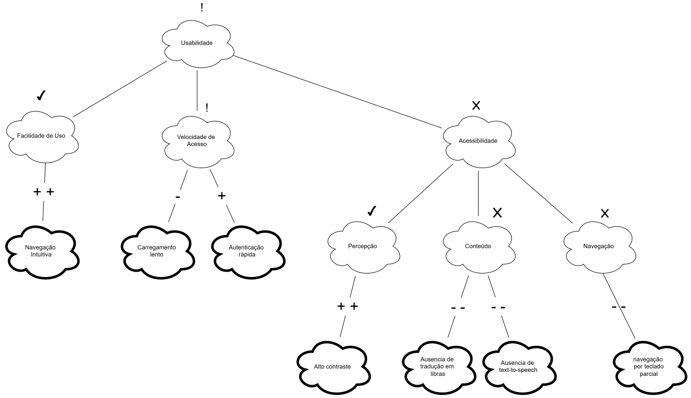

# NFR Framework

## Participantes do artefato

| Nome do Membro         |
| ---------------------- |
| Gabriel Mota Oliveira  |
| Yasmim de Souza Santos |

## O que é um NFR (Requisito Não Funcional)

NFR (Non-Functional Requirement, ou Requisito Não Funcional) é um requisito que não descreve uma função específica que o sistema deve executar, mas sim uma qualidade ou restrição sobre _como_ essas funções devem ser realizadas — por exemplo, usabilidade, segurança, desempenho, privacidade ou acessibilidade. Enquanto um requisito funcional responde "o que o sistema faz" (ex.: "o usuário deve conseguir buscar uma unidade de saúde"), um NFR responde "com que qualidade" isso deve acontecer (ex.: "a busca deve ser acessível a usuários com baixo letramento digital").

Chung et al. (2000) argumentam que NFRs raramente podem ser completamente satisfeitos de forma binária (sim/não): eles são, na prática, _softgoals_, sem um critério de satisfação claro e objetivo, cujo cumprimento é sempre uma questão de grau e de compromisso com outros objetivos do sistema. É justamente por isso que o NFR Framework trata a Usabilidade do Meu SUS Digital não como uma caixa a ser marcada, mas como um softgoal a ser refinado, discutido e avaliado ao longo do processo de design, o que motiva o uso do SIG descrito a seguir.

Para mais informações sobre: [Guia NFR Framework](../../../Projeto/GuiaNFR.md)

## O que é um SIG (Softgoal Interdependency Graph)

O SIG (Softgoal Interdependency Graph, ou Grafo de Interdependência de Softgoals) é a notação gráfica proposta pelo NFR Framework (CHUNG et al., 2000) para representar como um softgoal de alto nível se decompõe em softgoals mais específicos, e como decisões de design concretas impactam essa rede de objetivos. Um SIG é composto principalmente por três tipos de elementos:

- **Softgoals**: os próprios requisitos não funcionais, em diferentes níveis de abstração (ex.: Usabilidade → Acessibilidade → Percepção). Representados como nuvens de borda fina.
- **Métodos de Operacionalização**: decisões concretas de design ou implementação que contribuem — positiva ou negativamente — para um ou mais softgoals (ex.: "Autenticação via CPF e senha"). Representados como nuvens de borda grossa.
- **Claims**: argumentos ou justificativas usados para embasar por que determinada contribuição foi avaliada de certa forma, geralmente quando o contexto importa para a interpretação do link. Representados como nuvens de borda tracejada.

Esses elementos são conectados por **links de contribuição** (rotulados com `++`, `+`, `-` ou `--`), que indicam o quanto um nó filho satisfaz ou prejudica o nó pai, e podem opcionalmente receber avaliações finais (`!` crítico, `✓` aceito, `X` rejeitado) que sintetizam o resultado da análise para cada softgoal.

O valor do SIG está em tornar **explícitas e rastreáveis** as decisões de design e seus trade-offs: como o mesmo método pode satisfazer um softgoal enquanto prejudica outro, e como esse raciocínio pode ser revisitado posteriormente — funcionando como um registro do processo de design, e não apenas do seu resultado final.

## SIG de Usabilidade

### Versão 1

**Autoria: Gabriel Mota**

Estrutura inicial do SIG de Usabilidade: o softgoal _Usabilidade_ foi decomposto em _Facilidade de Uso_, _Velocidade de Acesso_ e _Acessibilidade_ (refinada em _Percepção_, _Conteúdo_ e _Navegação_), conectados aos métodos identificados no Meu SUS Digital por meio dos links de contribuição (`++`, `+`, `-`, `--`). Nesta versão, os nós ainda não têm avaliação final (`!`, `✓` ou `X`) — a análise mostra apenas o sentido de cada contribuição, sem indicar quais softgoals foram aceitos ou rejeitados.

### Versão 2

**Autoria: Yasmim de Souza**

A estrutura de nós e links da Versão 1 foi mantida, e os símbolos de avaliação final foram adicionados a cada softgoal. _Facilidade de Uso_ e _Percepção_ receberam `✓` (aceito), sustentados por métodos com contribuição fortemente positiva (_Navegação Intuitiva_ e _Alto contraste_). _Acessibilidade_, _Conteúdo_ e _Navegação_ receberam `X` (rejeitado), devido às lacunas de acessibilidade do sistema (ausência de libras, ausência de text-to-speech e navegação por teclado parcial, todas `--`). O softgoal raiz _Usabilidade_ e _Velocidade de Acesso_ receberam `!` (crítico), já que a contribuição positiva da autenticação rápida não compensa o carregamento lento somado à rejeição do ramo de Acessibilidade.

Arquivo editável: [SIG_Usabilidade.drawio](https://viewer.diagrams.net/?tags=%7B%7D&lightbox=1&highlight=0000ff&edit=_blank&layers=1&nav=1&title=SIG_Usabilidade&dark=0#R%3Cmxfile%3E%3Cdiagram%20name%3D%22P%C3%A1gina-1%22%20id%3D%22czpdueMdJo24robT8H2u%22%3E5Vtbc5s4FP41PDqDENdH22l2O9PtpJPJbvMog2yrlREVcmLvr18Bwlx8iR0jyDYvDjqII%2Bk79wMx4HS1%2BYOjZPkXizA1LDPaGPDWsCxgQyj%2FZJRtQfGBVRAWnERqUkV4IP9iRTQVdU0inDYmCsaoIEmTGLI4xqFo0BDn7KU5bc5oc9UELfAe4SFEdJ%2F6D4nEUp3C8ir6n5gsluXKwA2KOytUTlYnSZcoYi81EvxkwClnTBRXq80U0wy8Epfiubsjd3cb4zgW5zwg%2BK%2FH%2B2%2Brr09P7Ntnd47Npx%2BzkVNwwdEeChVbRUrZmof4BK9yntiW4HG2jiOcrW8acMK4WLIFixH9wlgiiUASf2AhtkrsaC2YJC3Fiqq7OI7GmRDlMGYxLih3hFLFUikE4gssTuzM2sEt9RSzFRZ8K5%2FjmCJBnpsnR0phFrt5FabyQsF6AcTuh4AYDgmx%2FyEg9oaE%2BASiFVKSj%2FTL2QGls0syYkjZWrKdvCyJwA8JyqF%2FkaGiiVDB6RnRteJkWC6Vy0wi8iwvF9nlY4pmhJIIRbi8K09Sm6CYYC7wprbDfcSWDYet3PNL5d2Bq2iKDSxdeOeoWv2ieofCHYJm%2FvOYsrfBZr0OW4msivzA14UitC%2Bw%2F97t%2BoBWz5ncVX0v7q81K2%2BM0ny9sZwAzWST8ynvl6o%2BqllAwawygSs8hHr0npF8f6X6%2B%2BDGtGFgB7brmjbwG2KFpncTmLbvubbn2MC0nSb%2FwuEqlvX0pL2KDeUqAQws24XQ9d3GKjawbgCwgWd6luNBF8DmKoXz3FslV6cdEldoWJdBHL7bCAMdfSprWBM9Snud6xg8rP2NKQvrPtlFq4xNPEuTAr6DoW6PzzjEaebMu4uMZ7j4XWQsfXygy8eDS3z8qzle0L0JptK6RMsIc1rNDF8zU4pmmE5Q%2BHORb2fKKOO1uRsivmczbxxHDZ%2FyYVAObzflQtlgWxvcY06kIDC%2FzCEA0EMMa%2FoC83hs6y%2FkBW5Tr12npddHolpX8cbqsqLx3m28AYOWNFbwMUD2Bw2w5scAORgSZO84pDqymDzVIFUxrim58P3ekgu93Y1UcPZz1z52zkwMD4XHGD3jBTKm0Bh7%2BS9kJxLGI9HzdB55aNlEpiHSCHBIUcS0LIB4SBC9kLWuvoXVympdW1vnwuoyqx3APR7JWCM8R2taSen1ylNjoplXnub7rD9Bz677gD3K0iDESdun9Glwu%2By6bPaY2vqtsEt78%2F%2B%2F9lZKRVNhd6KIGzDf77SFMIDwz5WtNSjKyqOpF%2FJoVsJj7oN9Ukx1%2Fycl9iXT%2FCZeiJJFnDlDyTDrbEwy30RCRMfqxopEUcZjwrHUW7UVM09oZOGen9yZGM7t%2BYZ1ScqmzYSucs4HtUA9Yt5A0Gq8jy7unXit54MmAzafp1hL06Q0yb5i6VQKBWcRczKO9L1Fa1dB%2BoJjKam%2B8Pt6qJjRldMDq7cc44CjG7yYHK9THMsSy7jqHYOUihgJNkoTjMNlz1niXk9WW1VmWb%2BvBDmK1i2TM%2FHqzfwomXGJf7%2Ba4Ju91eeDN4bGVLAim5KiS4W%2BbpsT9Aaq3peuZ4A6RZzL0LOSy%2B9q3Rnf6XRB1oSzZbcCEdCGszM0zgfdmJCbkUn6uU3M0%2F6H5wxAQiLUsxOy2wmFPjnq7RG9TY4Hk7c3CvFzLNZE1iR9ixD0JsEuX%2BdCLW1eecz6twXZuP5xQTauvi7IR9v6qP19QZcfbv9OXWE5rL74Lwrf6v8m4Kf%2FAA%3D%3D%3C%2Fdiagram%3E%3C%2Fmxfile%3E)

## Legenda do SIG

| Categoria                                    | Símbolo / Elemento Visual | Texto Original                | Tradução (Português)                      |
| :------------------------------------------- | :------------------------ | :---------------------------- | :---------------------------------------- |
| **Softgoals**                                | Nuvem com borda fina      | NFR Softgoal                  | Softgoal de NFR (Requisito Não-Funcional) |
|                                              | Nuvem com borda grossa    | Operationalizing Method       | Método de Operacionalização               |
|                                              | Nuvem com borda tracejada | Claim                         | Argumento (ou Afirmação)                  |
|                                              | `!`                       | Critical                      | Crítico                                   |
|                                              | `✓`                       | Accepted                      | Aceito                                    |
|                                              | `X`                       | Rejected                      | Rejeitado                                 |
| **Interdependência**  _(Interdependency)_ | Seta com linha contínua   | Implicity                     | Implícito                                 |
|                                              | Seta com linha tracejada  | Explicity                     | Explícito                                 |
|                                              | `++`                      | Strongly positive satisficing | Satisfação fortemente positiva            |
|                                              | `+`                       | Positive satisficing          | Satisfação positiva                       |
|                                              | `-`                       | Negative satisficing          | Satisfação negativa                       |
|                                              | `--`                      | Strongly Negative satisficing | Satisfação fortemente negativa            |

## Leitura do SIG

O SIG de Usabilidade construído para o Meu SUS Digital decompõe o softgoal de topo em três softgoals de segundo nível, Facilidade de Uso, Velocidade de Acesso e Acessibilidade, sendo o último refinado ainda em Percepção, Conteúdo e Navegação. Essa decomposição aproxima-se dos princípios POUR (Perceivable, Operable, Understandable, Robust) usados pela WCAG para estruturar requisitos de acessibilidade.

| Softgoal pai         | Softgoal/Método filho          | Contribuição | Tipo de nó (nuvem)          |
| -------------------- | ------------------------------ | :----------: | --------------------------- |
| Facilidade de Uso    | Navegação Intuitiva            |     `++`     | Método de Operacionalização |
| Velocidade de Acesso | Carregamento lento             |     `-`      | Método de Operacionalização |
| Velocidade de Acesso | Autenticação rápida            |     `+`      | Método de Operacionalização |
| Acessibilidade       | Percepção                      |      —       | Softgoal                    |
| Acessibilidade       | Conteúdo                       |      —       | Softgoal                    |
| Acessibilidade       | Navegação                      |      —       | Softgoal                    |
| Percepção            | Alto contraste                 |     `++`     | Método de Operacionalização |
| Conteúdo             | Ausência de tradução em libras |     `--`     | Método de Operacionalização |
| Conteúdo             | Ausência de text-to-speech     |     `--`     | Método de Operacionalização |
| Navegação            | Navegação por teclado parcial  |     `--`     | Método de Operacionalização |

O ramo de Velocidade de Acesso é o único que apresenta explicitamente um trade-off dentro do mesmo softgoal (um método com contribuição negativa e outro com contribuição positiva), evidenciando que nem toda decisão de otimização de desempenho converge no mesmo sentido.

## Embasamento teórico para criação:

1. CHUNG, Lawrence; NIXON, Brian A.; YU, Eric; MYLOPOULOS, John. Non-Functional Requirements in Software Engineering. Boston: Kluwer Academic Publishers, 2000. DOI: 10.1007/978-1-4615-5269-7.

---

| Nome do Membro                                        | Contribuição                                                                                                                      | Data       |
| ----------------------------------------------------- | --------------------------------------------------------------------------------------------------------------------------------- | ---------- |
| [Gustavo Fornaciari](https://github.com/GUGOFO)       | Criação do Repositorio                                                                                                            | 17/08/2026 |
| [Gabriel Mota Oliveira](https://github.com/Gabro-MO)  | adição do SIG de usabilidade, juntamente com a legenda da notação do NFR Framework (Foco_01)                                      | 26/08/2026 |
| [Gabriel Mota Oliveira](https://github.com/Gabro-MO)  | Adição do embasamento teórico e justificativa para o SIG, e comentarios extras (Foco_01)                                          | 27/08/2026 |
| [Yasmim de Souza Santos](https://github.com/eii-yahs) | Criação do arquivo separado para o artefato produzido                                                                             | 28/08/2026 |
| [Yasmim de Souza Santos](https://github.com/eii-yahs) | Adição da Versão 2 do SIG de Usabilidade, das seções conceituais "O que é um NFR" e "O que é um SIG", e da seção "Leitura do SIG" | 28/08/2026 |
| [Gabriel Mota Oliveira](https://github.com/Gabro-MO)  | Adição do link para guia NFR e correção textual (Foco_01)                                                                         | 28/08/2026 |
